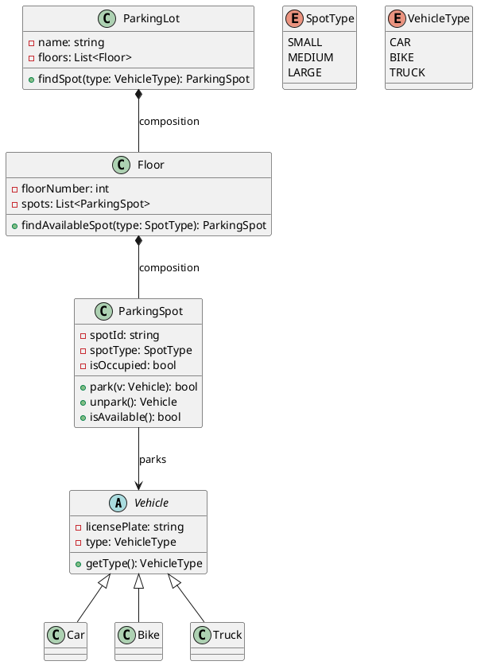
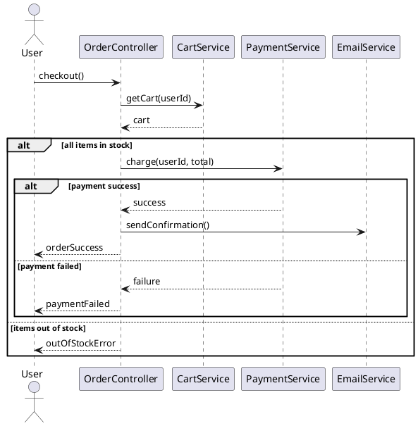
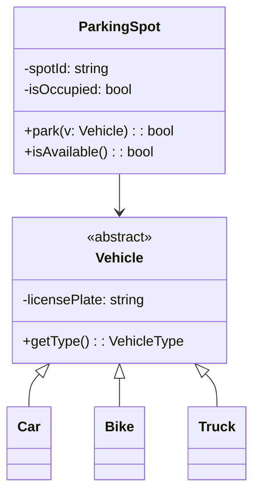

# Module 7: UML Diagrams & Modeling

> UML (Unified Modeling Language) is a standardized visual language for specifying, constructing, and documenting the artifacts of software systems. In Low-Level Design interviews, UML is the primary tool for communicating your design — you draw class diagrams to show structure, sequence diagrams to show behavior, and relationship lines to show how objects interact. Mastering UML means you can translate any design pattern, SOLID principle, or LLD problem into a clear, unambiguous visual representation.

---

## 7.1 Class Diagrams

> A class diagram is the most commonly used UML diagram in LLD. It shows the static structure of a system — the classes, their attributes, methods, and the relationships between them. In an interview, this is the first thing you draw after gathering requirements.

---

### Why Class Diagrams?

Class diagrams answer the fundamental design questions:
- **What classes exist** in the system?
- **What data** does each class hold (attributes)?
- **What behavior** does each class expose (methods)?
- **How do classes relate** to each other?
- **What is the type hierarchy** (inheritance, interfaces)?

```
Without a class diagram:
"So there's a User class that has a name and email, and it can place orders,
and Order has items, and each item references a product, and products have
categories, and categories can be nested, and..."
→ Confusing, ambiguous, easy to miss relationships.

With a class diagram:
One picture shows ALL of this clearly, unambiguously, at a glance.
```

---

### Basic Class Notation

A class is represented as a rectangle divided into three compartments:

```
┌─────────────────────────────┐
│         ClassName           │  ← Name compartment
├─────────────────────────────┤
│ - privateAttr: Type         │  ← Attributes compartment
│ # protectedAttr: Type       │
│ + publicAttr: Type          │
├─────────────────────────────┤
│ + publicMethod(): RetType   │  ← Methods compartment
│ - privateMethod(): void     │
│ # protectedMethod(): Type   │
└─────────────────────────────┘
```

---

### Classes, Attributes, Methods

**Attributes** represent the data a class holds. **Methods** represent the behavior a class exposes.

```
┌──────────────────────────────────────┐
│              BankAccount             │
├──────────────────────────────────────┤
│ - accountNumber: string              │
│ - balance: double                    │
│ - ownerName: string                  │
│ - accountType: AccountType           │
│ - isActive: bool                     │
│ - createdAt: DateTime                │
├──────────────────────────────────────┤
│ + deposit(amount: double): bool      │
│ + withdraw(amount: double): bool     │
│ + getBalance(): double               │
│ + transfer(to: BankAccount,          │
│            amount: double): bool     │
│ + getStatement(from: Date,           │
│                to: Date): Statement  │
│ - validateAmount(amount: double): bool│
│ - logTransaction(t: Transaction): void│
└──────────────────────────────────────┘
```

**Attribute syntax:** `visibility name: Type [= defaultValue]`
**Method syntax:** `visibility name(param: Type, ...): ReturnType`

```cpp
// The above class diagram translates to this C++ code:
class BankAccount {
private:
    string accountNumber;
    double balance;
    string ownerName;
    AccountType accountType;
    bool isActive;
    DateTime createdAt;

    bool validateAmount(double amount);
    void logTransaction(Transaction t);

public:
    bool deposit(double amount);
    bool withdraw(double amount);
    double getBalance();
    bool transfer(BankAccount& to, double amount);
    Statement getStatement(Date from, Date to);
};
```

---

### Visibility (Access Specifiers)

UML uses symbols to denote access levels:

| Symbol | Visibility | C++ Keyword | Meaning |
|--------|-----------|-------------|---------|
| `+` | Public | `public` | Accessible from anywhere |
| `-` | Private | `private` | Accessible only within the class |
| `#` | Protected | `protected` | Accessible within the class and subclasses |
| `~` | Package | (no direct C++ equivalent) | Accessible within the same package/namespace |

```
┌──────────────────────────────────┐
│            Employee              │
├──────────────────────────────────┤
│ - id: int                        │  ← private
│ - name: string                   │  ← private
│ # department: string             │  ← protected (subclasses can access)
│ + email: string                  │  ← public
├──────────────────────────────────┤
│ + getName(): string              │  ← public
│ + setName(n: string): void       │  ← public
│ # calculateBonus(): double       │  ← protected
│ - validateEmail(e: string): bool │  ← private
└──────────────────────────────────┘
```

```cpp
class Employee {
private:
    int id;
    string name;
    bool validateEmail(const string& e);

protected:
    string department;
    double calculateBonus();

public:
    string email;
    string getName();
    void setName(const string& n);
};
```

**Best practice:** In a well-designed class, most attributes are private (`-`) and most methods that clients use are public (`+`). Protected members are for subclass use. This reflects encapsulation.

---

### Static Members (Underlined)

Static members belong to the class itself, not to any instance. In UML, they are shown **underlined**.

```
┌──────────────────────────────────┐
│           Singleton              │
├──────────────────────────────────┤
│ - instance: Singleton            │  ← underlined = static
│ - data: string                   │
├──────────────────────────────────┤
│ + getInstance(): Singleton       │  ← underlined = static
│ + getData(): string              │
│ - Singleton()                    │  ← private constructor
└──────────────────────────────────┘
```

In text-based UML (interviews on whiteboards), you can denote static with an underline or by writing `{static}`:

```
- instance: Singleton {static}
+ getInstance(): Singleton {static}
```

```cpp
class Singleton {
private:
    static Singleton* instance;  // static attribute
    string data;
    Singleton();                 // private constructor

public:
    static Singleton& getInstance();  // static method
    string getData();
};
```

**Other common notations for static:**
- Some tools use `$` prefix: `$instance`, `$getInstance()`
- In PlantUML: `{static}` keyword
- On whiteboards: underline or write "(static)" next to it

---

### Abstract Classes and Methods (Italics)

Abstract classes (classes that cannot be instantiated) and abstract/pure virtual methods are shown in *italics* in UML. On a whiteboard, you can write `{abstract}` or use `<<abstract>>`.

```
┌──────────────────────────────────┐
│        «abstract»                │
│          Shape                   │  ← italic name = abstract class
├──────────────────────────────────┤
│ # x: int                        │
│ # y: int                        │
│ # color: string                 │
├──────────────────────────────────┤
│ + draw(): void {abstract}       │  ← italic = pure virtual
│ + area(): double {abstract}     │  ← italic = pure virtual
│ + moveTo(x: int, y: int): void  │  ← concrete method
│ + getColor(): string            │  ← concrete method
└──────────────────────────────────┘
         ▲
         │ (inheritance)
    ┌────┴─────┐
    │          │
┌───┴───┐ ┌───┴────┐
│Circle │ │Rectangle│  ← concrete classes
└───────┘ └────────┘
```

```cpp
class Shape {  // abstract class
protected:
    int x, y;
    string color;

public:
    virtual void draw() = 0;       // pure virtual (abstract)
    virtual double area() = 0;     // pure virtual (abstract)
    void moveTo(int x, int y);     // concrete
    string getColor();             // concrete
    virtual ~Shape() = default;
};

class Circle : public Shape {
public:
    void draw() override;
    double area() override;
};

class Rectangle : public Shape {
public:
    void draw() override;
    double area() override;
};
```

---

### Interfaces

In UML, interfaces are shown with the `<<interface>>` stereotype. In C++, interfaces are pure abstract classes (all methods are pure virtual).

```
┌──────────────────────────────────┐
│        «interface»               │
│         Printable                │
├──────────────────────────────────┤
│                                  │  ← no attributes (typically)
├──────────────────────────────────┤
│ + print(): void                  │
│ + toString(): string             │
└──────────────────────────────────┘

┌──────────────────────────────────┐
│        «interface»               │
│         Serializable             │
├──────────────────────────────────┤
│                                  │
├──────────────────────────────────┤
│ + serialize(): string            │
│ + deserialize(data: string): void│
└──────────────────────────────────┘
```

```cpp
// C++ interface = pure abstract class
class Printable {
public:
    virtual void print() = 0;
    virtual string toString() = 0;
    virtual ~Printable() = default;
};

class Serializable {
public:
    virtual string serialize() = 0;
    virtual void deserialize(const string& data) = 0;
    virtual ~Serializable() = default;
};
```

---

### Enumerations

Enums are shown with the `<<enumeration>>` stereotype:

```
┌──────────────────────────────────┐
│       «enumeration»              │
│        OrderStatus               │
├──────────────────────────────────┤
│ PENDING                          │
│ CONFIRMED                        │
│ SHIPPED                          │
│ DELIVERED                        │
│ CANCELLED                        │
└──────────────────────────────────┘
```

```cpp
enum class OrderStatus {
    PENDING,
    CONFIRMED,
    SHIPPED,
    DELIVERED,
    CANCELLED
};
```

---

### Complete Class Diagram Example — E-Commerce System

Here's how a real class diagram looks for a small system:

```
┌──────────────────────┐       ┌──────────────────────┐
│        User          │       │    «enumeration»     │
├──────────────────────┤       │     OrderStatus      │
│ - id: int            │       ├──────────────────────┤
│ - name: string       │       │ PENDING              │
│ - email: string      │       │ CONFIRMED            │
│ - password: string   │       │ SHIPPED              │
├──────────────────────┤       │ DELIVERED            │
│ + register(): bool   │       │ CANCELLED            │
│ + login(): bool      │       └──────────────────────┘
│ + placeOrder(): Order│
│ + getOrders(): List  │
└──────────┬───────────┘
           │ 1
           │ places
           │ *
┌──────────┴───────────┐       ┌──────────────────────┐
│       Order          │       │      Product         │
├──────────────────────┤       ├──────────────────────┤
│ - orderId: int       │       │ - productId: int     │
│ - orderDate: Date    │       │ - name: string       │
│ - status: OrderStatus│       │ - price: double      │
│ - totalAmount: double│       │ - stock: int         │
├──────────────────────┤       ├──────────────────────┤
│ + addItem(): void    │       │ + getPrice(): double │
│ + removeItem(): void │       │ + isInStock(): bool  │
│ + calculateTotal()   │       │ + reduceStock(): void│
│ + cancel(): bool     │       └──────────┬───────────┘
└──────────┬───────────┘                  │
           │ 1                            │ 1
           │ contains                     │
           │ *                            │
┌──────────┴───────────┐                  │
│     OrderItem        │──────────────────┘
├──────────────────────┤    references
│ - quantity: int      │
│ - unitPrice: double  │
├──────────────────────┤
│ + getSubtotal(): double│
└──────────────────────┘
```

This single diagram communicates:
- What classes exist and their responsibilities
- What data each class holds
- What operations each class supports
- How classes relate (User places Orders, Orders contain OrderItems, OrderItems reference Products)
- Multiplicity (one User has many Orders, one Order has many OrderItems)

---


## 7.2 Relationships

> Relationships are the lines between classes in a UML diagram. They show how classes are connected — who uses whom, who owns whom, who inherits from whom. Getting relationships right is critical in LLD interviews because they directly map to code structure (inheritance, composition, references, etc.).

---

### Overview of All Relationship Types

```
RELATIONSHIP          UML NOTATION              STRENGTH
─────────────────────────────────────────────────────────
Dependency            - - - - - - ->            Weakest
Association           ─────────────>
Aggregation           ────────────◇>
Composition           ────────────◆>
Inheritance           ─────────────▷            
Realization           - - - - - - ▷             Strongest
                                                (in terms of coupling)
```

| Relationship | Line Style | Arrow | Meaning | C++ Mapping |
|-------------|-----------|-------|---------|-------------|
| Dependency | Dashed | Open arrow `-->` | "uses temporarily" | Parameter, local variable |
| Association | Solid | Open arrow `-->` | "uses / knows about" | Member pointer/reference |
| Aggregation | Solid | Open diamond `--◇` | "has-a (weak)" | Member pointer/reference (shared) |
| Composition | Solid | Filled diamond `--◆` | "has-a (strong)" | Member object or `unique_ptr` |
| Inheritance | Solid | Hollow triangle `--▷` | "is-a" | `: public Base` |
| Realization | Dashed | Hollow triangle `--▷` | "implements" | `: public Interface` (pure virtual) |

---

### Association (Uses / Knows About)

An association means one class **knows about** and **uses** another class. It's a structural relationship — the reference is stored as a member variable.

```
┌──────────┐           ┌──────────┐
│ Teacher  │──────────>│ Course   │
└──────────┘ teaches   └──────────┘
```

**Notation:** Solid line with optional arrow showing navigability (who knows about whom).

```cpp
// Unidirectional association: Teacher knows about Course
class Course;  // forward declaration

class Teacher {
    vector<Course*> courses;  // Teacher knows about Courses
public:
    void teach(Course* c) { courses.push_back(c); }
};

class Course {
    string name;
    // Course does NOT know about Teacher (unidirectional)
};
```

```
// Bidirectional association: both know about each other
┌──────────┐           ┌──────────┐
│ Student  │<─────────>│ Course   │
└──────────┘ enrolls   └──────────┘
```

```cpp
// Bidirectional: both hold references
class Course;

class Student {
    vector<Course*> courses;  // Student knows about Courses
};

class Course {
    vector<Student*> students;  // Course knows about Students
};
```

**Key characteristics:**
- Objects have independent lifecycles
- Either or both can exist without the other
- The relationship is stored as a member variable (pointer, reference, or smart pointer)

---

### Aggregation (Has-A, Weak Ownership)

Aggregation is a special form of association that represents a **"has-a"** relationship with **weak ownership**. The contained object can exist independently of the container.

```
┌──────────────┐           ┌──────────────┐
│  Department  │◇─────────>│   Employee   │
└──────────────┘ has       └──────────────┘
```

**Notation:** Solid line with an **open (hollow) diamond** on the container side.

```cpp
class Employee {
    string name;
    int id;
public:
    Employee(const string& n, int i) : name(n), id(i) {}
    string getName() const { return name; }
};

class Department {
    string name;
    vector<Employee*> employees;  // aggregation: pointers, not owned

public:
    Department(const string& n) : name(n) {}

    void addEmployee(Employee* emp) {
        employees.push_back(emp);
    }

    void removeEmployee(Employee* emp) {
        employees.erase(
            remove(employees.begin(), employees.end(), emp),
            employees.end()
        );
    }

    // Department does NOT delete employees in destructor!
    // Employees exist independently.
    ~Department() {
        // employees are NOT deleted — they belong to someone else
        employees.clear();
    }
};

// Usage — employees exist independently of department
Employee alice("Alice", 1);
Employee bob("Bob", 2);

{
    Department engineering("Engineering");
    engineering.addEmployee(&alice);
    engineering.addEmployee(&bob);
}  // Department destroyed, but alice and bob still exist!

// alice and bob are still alive and valid here
```

**Key characteristics:**
- Container has a reference to the contained object
- Contained object can exist **without** the container
- Contained object can be **shared** among multiple containers
- Destroying the container does **NOT** destroy the contained objects
- Think: "Department has Employees, but Employees exist independently"

---

### Composition (Has-A, Strong Ownership)

Composition is a stronger form of aggregation that represents **strong ownership** with **lifecycle dependency**. The contained object cannot exist without the container — when the container is destroyed, the contained objects are destroyed too.

```
┌──────────────┐           ┌──────────────┐
│    House     │◆─────────>│     Room     │
└──────────────┘ has       └──────────────┘
```

**Notation:** Solid line with a **filled (solid) diamond** on the container side.

```cpp
class Room {
    string name;
    double area;
public:
    Room(const string& n, double a) : name(n), area(a) {}
    string getName() const { return name; }
    double getArea() const { return area; }
};

class House {
    string address;
    vector<unique_ptr<Room>> rooms;  // composition: owned exclusively

public:
    House(const string& addr) : address(addr) {}

    void addRoom(const string& name, double area) {
        rooms.push_back(make_unique<Room>(name, area));
    }

    double getTotalArea() const {
        double total = 0;
        for (const auto& room : rooms) {
            total += room->getArea();
        }
        return total;
    }

    // When House is destroyed, all Rooms are destroyed too!
    // unique_ptr handles this automatically.
    ~House() = default;  // rooms destroyed with the house
};

// Usage
{
    House myHouse("123 Main St");
    myHouse.addRoom("Living Room", 30.0);
    myHouse.addRoom("Bedroom", 20.0);
    myHouse.addRoom("Kitchen", 15.0);
}  // House destroyed → all Rooms destroyed too!
// Rooms cannot exist without the House
```

**Key characteristics:**
- Container **owns** the contained objects exclusively
- Contained objects **cannot exist** without the container
- Contained objects are **NOT shared** — they belong to exactly one container
- Destroying the container **destroys** the contained objects
- Think: "House has Rooms — Rooms don't exist without a House"

---

### Aggregation vs Composition — The Critical Difference

This is one of the most frequently asked questions in LLD interviews:

| Aspect | Aggregation (◇) | Composition (◆) |
|--------|-----------------|-----------------|
| Ownership | Weak (shared) | Strong (exclusive) |
| Lifecycle | Independent | Dependent (part dies with whole) |
| Sharing | Part can belong to multiple wholes | Part belongs to exactly one whole |
| Destruction | Whole destroyed → parts survive | Whole destroyed → parts destroyed |
| C++ implementation | Raw pointer, `shared_ptr` | Value member, `unique_ptr` |
| UML symbol | Open diamond ◇ | Filled diamond ◆ |

**Examples to remember:**

| Relationship | Type | Why? |
|-------------|------|------|
| University → Professor | Aggregation ◇ | Professor exists without University |
| University → Department | Composition ◆ | Department doesn't exist without University |
| Car → Engine | Composition ◆ | Engine is built for this specific car |
| Car → Driver | Aggregation ◇ | Driver exists independently |
| Order → OrderItem | Composition ◆ | OrderItem has no meaning without Order |
| Order → Product | Aggregation ◇ | Product exists independently |
| Body → Heart | Composition ◆ | Heart doesn't exist without Body |
| Library → Book | Aggregation ◇ | Book exists independently of Library |
| Folder → File | Composition ◆ | File belongs to one Folder (in this model) |
| Playlist → Song | Aggregation ◇ | Song exists in multiple Playlists |

---

### Inheritance / Generalization (Is-A)

Inheritance represents an **"is-a"** relationship. The subclass inherits all attributes and methods of the superclass and can add or override them.

```
         ┌──────────────┐
         │    Animal     │
         ├──────────────┤
         │ # name: string│
         │ # age: int    │
         ├──────────────┤
         │ + eat(): void │
         │ + sleep(): void│
         │ + speak(): void│
         │   {abstract}  │
         └──────┬───────┘
                ▲
                │ (inheritance — hollow triangle)
         ┌──────┴──────┐
         │             │
    ┌────┴────┐  ┌─────┴────┐
    │   Dog   │  │   Cat    │
    ├─────────┤  ├──────────┤
    │ - breed │  │ - indoor │
    ├─────────┤  ├──────────┤
    │ +speak()│  │ +speak() │
    │ +fetch()│  │ +purr()  │
    └─────────┘  └──────────┘
```

**Notation:** Solid line with a **hollow (open) triangle** pointing to the superclass.

```cpp
class Animal {
protected:
    string name;
    int age;

public:
    Animal(const string& n, int a) : name(n), age(a) {}
    void eat() { cout << name << " is eating" << endl; }
    void sleep() { cout << name << " is sleeping" << endl; }
    virtual void speak() = 0;  // abstract
    virtual ~Animal() = default;
};

class Dog : public Animal {
    string breed;
public:
    Dog(const string& n, int a, const string& b)
        : Animal(n, a), breed(b) {}
    void speak() override { cout << name << " says: Woof!" << endl; }
    void fetch() { cout << name << " fetches the ball" << endl; }
};

class Cat : public Animal {
    bool indoor;
public:
    Cat(const string& n, int a, bool in)
        : Animal(n, a), indoor(in) {}
    void speak() override { cout << name << " says: Meow!" << endl; }
    void purr() { cout << name << " is purring" << endl; }
};
```

**Key characteristics:**
- Subclass inherits ALL attributes and methods from superclass
- Subclass can ADD new attributes and methods
- Subclass can OVERRIDE inherited methods
- Represents "is-a" relationship (Dog IS-A Animal)
- Arrow points FROM subclass TO superclass (child → parent)

---

### Realization / Implementation (Implements Interface)

Realization means a class **implements** an interface — it provides concrete implementations for all the abstract methods defined in the interface.

```
    ┌──────────────────┐
    │   «interface»    │
    │    Flyable       │
    ├──────────────────┤
    │ + fly(): void    │
    │ + land(): void   │
    └────────┬─────────┘
             ▲
             ┆ (realization — dashed line, hollow triangle)
        ┌────┴─────┐
        │          │
   ┌────┴───┐ ┌───┴────┐
   │ Eagle  │ │Airplane│
   └────────┘ └────────┘
```

**Notation:** **Dashed** line with a **hollow triangle** pointing to the interface.

The difference from inheritance:
- **Inheritance** (solid line): extends a class (may inherit implementation)
- **Realization** (dashed line): implements an interface (no implementation inherited)

```cpp
// Interface
class Flyable {
public:
    virtual void fly() = 0;
    virtual void land() = 0;
    virtual ~Flyable() = default;
};

// Realization — Eagle implements Flyable
class Eagle : public Flyable {
public:
    void fly() override { cout << "Eagle soaring through the sky" << endl; }
    void land() override { cout << "Eagle landing on a branch" << endl; }
};

// Realization — Airplane implements Flyable
class Airplane : public Flyable {
public:
    void fly() override { cout << "Airplane cruising at 35,000 feet" << endl; }
    void land() override { cout << "Airplane landing on runway" << endl; }
};
```

**In C++, both inheritance and realization use `: public`, so the distinction is conceptual:**
- If the base class has any concrete methods → Inheritance (solid line)
- If the base class is purely abstract (all pure virtual) → Realization (dashed line)

---

### Dependency (Uses Temporarily)

A dependency means one class **uses** another temporarily — typically as a method parameter, local variable, or return type. It's the **weakest** relationship.

```
┌──────────────┐           ┌──────────────┐
│   OrderService│- - - - ->│   EmailService│
└──────────────┘ uses      └──────────────┘
```

**Notation:** **Dashed** line with an **open arrow**.

```cpp
class EmailService {
public:
    void sendEmail(const string& to, const string& subject, const string& body) {
        cout << "Sending email to " << to << endl;
    }
};

class OrderService {
    // NO member variable for EmailService — it's just used temporarily

public:
    void processOrder(const string& orderId, EmailService& emailService) {
        // EmailService is a parameter — temporary usage
        cout << "Processing order " << orderId << endl;
        emailService.sendEmail("customer@example.com", "Order Confirmed",
                                "Your order " + orderId + " is confirmed.");
    }
};
```

**Key characteristics:**
- No member variable — the used class appears only in method signatures or local scope
- Weakest relationship — changing the used class has minimal impact
- Shown as a dashed arrow
- Think: "OrderService uses EmailService, but doesn't hold a reference to it"

**Dependency vs Association:**

| Aspect | Dependency (dashed) | Association (solid) |
|--------|-------------------|-------------------|
| Duration | Temporary (method scope) | Persistent (object lifetime) |
| Storage | Parameter, local variable | Member variable |
| Coupling | Weaker | Stronger |
| Example | `void process(Logger& log)` | `Logger* logger;` (member) |

---

### Multiplicity

Multiplicity specifies **how many instances** of one class relate to instances of another class. It's written near the ends of relationship lines.

```
┌──────────┐  1      *  ┌──────────┐
│ Customer │────────────>│  Order   │
└──────────┘             └──────────┘
"One Customer has zero or more Orders"

┌──────────┐  1      1  ┌──────────┐
│  Person  │────────────>│ Passport │
└──────────┘             └──────────┘
"One Person has exactly one Passport"

┌──────────┐  *      *  ┌──────────┐
│ Student  │────────────>│  Course  │
└──────────┘             └──────────┘
"Many Students enroll in many Courses"
```

**Common multiplicity notations:**

| Notation | Meaning | Example |
|----------|---------|---------|
| `1` | Exactly one | Person → Passport |
| `0..1` | Zero or one (optional) | Employee → ParkingSpot |
| `*` or `0..*` | Zero or more | Customer → Order |
| `1..*` | One or more (at least one) | Order → OrderItem |
| `2..5` | Between 2 and 5 | Team → Player (basketball) |
| `n` | Exactly n | Bicycle → Wheel (2) |

```cpp
// 1 to * (one-to-many)
class Customer {
    vector<Order*> orders;  // 0 or more orders
};

// 1 to 1 (one-to-one)
class Person {
    unique_ptr<Passport> passport;  // exactly one
};

// * to * (many-to-many)
class Student {
    vector<Course*> courses;  // many courses
};
class Course {
    vector<Student*> students;  // many students
};

// 1 to 0..1 (optional)
class Employee {
    ParkingSpot* parkingSpot = nullptr;  // may or may not have one
};
```

---

### Complete Relationship Example — Library System

Putting all relationships together in one diagram:

```
┌──────────────────┐
│   «interface»    │
│   Searchable     │
├──────────────────┤
│ + search(query:  │
│   string): List  │
└────────┬─────────┘
         ▲
         ┆ realization (dashed, hollow triangle)
         ┆
┌────────┴─────────┐  1    *  ┌──────────────────┐
│     Library      │◆────────>│    Section       │
├──────────────────┤          ├──────────────────┤
│ - name: string   │          │ - name: string   │
│ - address: string│          │ - floor: int     │
├──────────────────┤          └──────────────────┘
│ + search(): List │               composition (filled diamond)
│ + addBook(): void│               Section can't exist without Library
└──────┬───────────┘
       │
       │ 1    *
       │◇──────────────────────┐
       │  aggregation          │
       │  (open diamond)       │
       │                       ▼
       │              ┌──────────────────┐
       │              │      Book        │
       │              ├──────────────────┤
       │              │ - isbn: string   │
       │              │ - title: string  │
       │              │ - author: string │
       │              ├──────────────────┤
       │              │ + getInfo(): string│
       │              └──────────────────┘
       │                       ▲
       │                       │ inheritance (solid, hollow triangle)
       │              ┌────────┴────────┐
       │              │                 │
       │        ┌─────┴──────┐  ┌──────┴──────┐
       │        │  EBook     │  │ PhysicalBook│
       │        ├────────────┤  ├─────────────┤
       │        │-fileSize   │  │-weight      │
       │        │-format     │  │-pages       │
       │        └────────────┘  └─────────────┘
       │
       │ 1    *
       │──────────────────────>┌──────────────────┐
       │  association          │     Member       │
       │                       ├──────────────────┤
       │                       │ - name: string   │
       │                       │ - memberId: int  │
       │                       ├──────────────────┤
       │                       │ + borrow(): void │
       │                       │ + return(): void │
       │                       └──────┬───────────┘
       │                              │
       │                              │ dependency (dashed arrow)
       │                              ▼
       │                       ┌──────────────────┐
       │                       │  FineCalculator  │
       │                       ├──────────────────┤
       │                       │ + calculate(     │
       │                       │   days: int):    │
       │                       │   double         │
       │                       └──────────────────┘
```

**Reading this diagram:**
- Library **implements** Searchable (realization)
- Library **is composed of** Sections (composition — sections die with library)
- Library **aggregates** Books (aggregation — books can exist independently)
- Library **is associated with** Members (association)
- Member **depends on** FineCalculator (dependency — uses temporarily)
- EBook and PhysicalBook **inherit from** Book (inheritance)

---

### Relationship Decision Guide

When deciding which relationship to use, ask these questions in order:

```
1. Does class A inherit from class B?
   YES → Is B an interface (all pure virtual)?
         YES → Realization (dashed, hollow triangle)
         NO  → Inheritance (solid, hollow triangle)

2. Does class A contain class B?
   YES → Does B exist independently of A?
         YES → Aggregation (open diamond ◇)
         NO  → Composition (filled diamond ◆)

3. Does class A hold a persistent reference to class B?
   YES → Association (solid line)

4. Does class A use class B only temporarily?
   YES → Dependency (dashed line)
```

---


## 7.3 Sequence Diagrams

> Sequence diagrams show how objects interact over time. They capture the **order of messages** exchanged between objects to accomplish a specific task. While class diagrams show static structure, sequence diagrams show dynamic behavior — they answer "what happens when the user clicks Buy?"

---

### Why Sequence Diagrams?

Class diagrams show WHAT exists. Sequence diagrams show HOW things work:

```
Class Diagram tells you:
  "OrderService has a method processOrder() and depends on PaymentService"

Sequence Diagram tells you:
  "When processOrder() is called, it first validates the cart, then calls
   PaymentService.charge(), then calls InventoryService.reserve(), then
   calls EmailService.sendConfirmation(), in that exact order"
```

In LLD interviews, you typically draw:
1. A class diagram (structure)
2. One or two sequence diagrams for key flows (behavior)

---

### Basic Elements

```
  ┌───────┐          ┌───────┐          ┌───────┐
  │ User  │          │ Server│          │  DB   │
  └───┬───┘          └───┬───┘          └───┬───┘
      │                  │                  │
      │   Lifeline       │   Lifeline       │   Lifeline
      │   (dashed         │                  │
      │    vertical       │                  │
      │    line)          │                  │
      │                  │                  │
      ▼                  ▼                  ▼
```

| Element | Description | Notation |
|---------|-------------|----------|
| **Object/Participant** | An instance involved in the interaction | Rectangle at the top |
| **Lifeline** | The time axis for an object | Dashed vertical line below the object |
| **Activation bar** | Period when an object is active/processing | Thin rectangle on the lifeline |
| **Message** | Communication between objects | Arrow between lifelines |
| **Return message** | Response to a message | Dashed arrow going back |

---

### Lifelines and Activation Bars

A **lifeline** represents the existence of an object over time (top to bottom). An **activation bar** (thin rectangle on the lifeline) shows when the object is actively processing.

```
  ┌────────┐                    ┌────────┐
  │ Client │                    │ Server │
  └───┬────┘                    └───┬────┘
      │                             │
      │    request()                │
      │────────────────────────────>│
      │                             │
      │                          ┌──┴──┐  ← activation bar
      │                          │     │     (Server is processing)
      │                          │     │
      │    response               │     │
      │<─ ─ ─ ─ ─ ─ ─ ─ ─ ─ ─ ─┤     │  ← dashed = return
      │                          └──┬──┘  ← processing complete
      │                             │
```

**Activation bar rules:**
- Starts when the object receives a message
- Ends when the object returns/finishes processing
- Can be nested (object calls itself — recursion)
- Shows the "call stack" visually

---

### Synchronous vs Asynchronous Messages

**Synchronous message:** The sender waits for the receiver to finish before continuing. Shown with a **filled arrowhead**.

**Asynchronous message:** The sender continues immediately without waiting. Shown with an **open arrowhead**.

```
  ┌────────┐          ┌────────┐          ┌────────┐
  │ Client │          │ Server │          │ Logger │
  └───┬────┘          └───┬────┘          └───┬────┘
      │                   │                   │
      │  processOrder()   │                   │
      │──────────────────>│                   │  ← synchronous (filled arrow)
      │                   │                   │     Client WAITS
      │                   │  log("order")     │
      │                   │ ─ ─ ─ ─ ─ ─ ─ ─ >│  ← asynchronous (open arrow)
      │                   │                   │     Server does NOT wait
      │                   │                   │
      │                   │  doProcessing()   │
      │                   │────┐              │
      │                   │    │ self-call    │
      │                   │<───┘              │
      │                   │                   │
      │   result          │                   │
      │<─ ─ ─ ─ ─ ─ ─ ─ ─│                   │  ← return message (dashed)
      │                   │                   │
```

| Message Type | Arrow Style | Sender Behavior | Example |
|-------------|------------|-----------------|---------|
| Synchronous | `──────>` (filled) | Waits for response | Function call, HTTP request |
| Asynchronous | `─ ─ ─ >` (open) | Continues immediately | Fire-and-forget, message queue |
| Return | `<─ ─ ─ ─` (dashed) | Response to sync call | Return value |
| Self-call | `──┐` then `<──┘` | Object calls itself | Recursion, private method |

---

### Return Messages

Return messages show the response flowing back to the caller. They are **dashed arrows** going in the opposite direction.

```
  ┌────────┐          ┌────────────┐          ┌──────────┐
  │ Client │          │ UserService│          │ Database │
  └───┬────┘          └─────┬──────┘          └────┬─────┘
      │                     │                      │
      │  getUser(id=42)     │                      │
      │────────────────────>│                      │
      │                     │                      │
      │                     │  SELECT * FROM users │
      │                     │  WHERE id=42         │
      │                     │─────────────────────>│
      │                     │                      │
      │                     │  ResultSet(row data) │
      │                     │<─ ─ ─ ─ ─ ─ ─ ─ ─ ─│
      │                     │                      │
      │  User(id=42,        │                      │
      │       name="Alice") │                      │
      │<─ ─ ─ ─ ─ ─ ─ ─ ─ ─│                      │
      │                     │                      │
```

**Convention:** Return messages are optional in UML — you can omit them if the return is obvious. But in interviews, showing them makes the flow clearer.

---

### Loops, Conditions, and Fragments

UML sequence diagrams use **combined fragments** to show control flow (loops, conditions, optional behavior).

#### Loop Fragment

```
  ┌────────┐          ┌────────────┐
  │ Client │          │ ItemService│
  └───┬────┘          └─────┬──────┘
      │                     │
      │  ┌─────────────────────────────┐
      │  │ loop [for each item in cart]│
      │  │                             │
      │  │  validateItem(item)         │
      │  │────────────────────────────>│
      │  │                             │
      │  │  valid: bool                │
      │  │<─ ─ ─ ─ ─ ─ ─ ─ ─ ─ ─ ─ ─│
      │  │                             │
      │  └─────────────────────────────┘
      │                     │
```

#### Alt (If-Else) Fragment

```
  ┌────────┐          ┌────────────┐          ┌──────────┐
  │ Client │          │ AuthService│          │ Database │
  └───┬────┘          └─────┬──────┘          └────┬─────┘
      │                     │                      │
      │  login(user, pass)  │                      │
      │────────────────────>│                      │
      │                     │                      │
      │                     │  findUser(user)      │
      │                     │─────────────────────>│
      │                     │                      │
      │                     │  userData             │
      │                     │<─ ─ ─ ─ ─ ─ ─ ─ ─ ─│
      │                     │                      │
      │  ┌──────────────────────────────────────────┐
      │  │ alt [password matches]                   │
      │  │                                          │
      │  │  loginSuccess(token)                     │
      │  │<─ ─ ─ ─ ─ ─ ─ ─ ─│                      │
      │  │                                          │
      │  ├──────────────────────────────────────────┤
      │  │ [else: password doesn't match]           │
      │  │                                          │
      │  │  loginFailed("Invalid credentials")      │
      │  │<─ ─ ─ ─ ─ ─ ─ ─ ─│                      │
      │  │                                          │
      │  └──────────────────────────────────────────┘
      │                     │                      │
```

#### Opt (Optional) Fragment

```
  ┌────────┐          ┌────────────┐          ┌──────────┐
  │ Client │          │OrderService│          │EmailSvc  │
  └───┬────┘          └─────┬──────┘          └────┬─────┘
      │                     │                      │
      │  placeOrder(order)  │                      │
      │────────────────────>│                      │
      │                     │                      │
      │  ┌──────────────────────────────────────────┐
      │  │ opt [customer has email]                 │
      │  │                                          │
      │  │                  │  sendConfirmation()   │
      │  │                  │─────────────────────>│
      │  │                  │                      │
      │  └──────────────────────────────────────────┘
      │                     │                      │
      │  orderConfirmed     │                      │
      │<─ ─ ─ ─ ─ ─ ─ ─ ─ ─│                      │
      │                     │                      │
```

**Summary of fragments:**

| Fragment | Keyword | Meaning | Equivalent Code |
|----------|---------|---------|----------------|
| `alt` | Alternative | If-else | `if (...) { } else { }` |
| `opt` | Optional | If (no else) | `if (...) { }` |
| `loop` | Loop | Repeat | `for` / `while` |
| `par` | Parallel | Concurrent execution | Threads, async |
| `break` | Break | Exit the enclosing fragment | `break` |
| `ref` | Reference | Refers to another sequence diagram | Function call to another diagram |

---

### Complete Sequence Diagram — Online Order Flow

```
  ┌──────┐    ┌───────────┐    ┌──────────┐    ┌─────────┐    ┌─────────┐    ┌──────────┐
  │ User │    │ OrderCtrl │    │ CartSvc  │    │ PaySvc  │    │ InvSvc  │    │ EmailSvc │
  └──┬───┘    └─────┬─────┘    └────┬─────┘    └────┬────┘    └────┬────┘    └────┬─────┘
     │              │               │               │              │              │
     │ checkout()   │               │               │              │              │
     │─────────────>│               │               │              │              │
     │              │               │               │              │              │
     │              │ getCart(userId)│               │              │              │
     │              │──────────────>│               │              │              │
     │              │               │               │              │              │
     │              │ cart           │               │              │              │
     │              │<─ ─ ─ ─ ─ ─ ─ │               │              │              │
     │              │               │               │              │              │
     │              │ ┌─────────────────────────────────────────────┐              │
     │              │ │ loop [for each item in cart]                │              │
     │              │ │                                             │              │
     │              │ │ checkStock(itemId, qty)                     │              │
     │              │ │────────────────────────────────────────────>│              │
     │              │ │                                             │              │
     │              │ │ available: bool                             │              │
     │              │ │<─ ─ ─ ─ ─ ─ ─ ─ ─ ─ ─ ─ ─ ─ ─ ─ ─ ─ ─ ─│              │
     │              │ │                                             │              │
     │              │ └─────────────────────────────────────────────┘              │
     │              │               │               │              │              │
     │              │ ┌──────────────────────────────────────────────────────────────┐
     │              │ │ alt [all items in stock]                                    │
     │              │ │                                                             │
     │              │ │ charge(userId, total)        │              │              │
     │              │ │────────────────────────────>│              │              │
     │              │ │                              │              │              │
     │              │ │ ┌────────────────────────────────────────────────────────────┐
     │              │ │ │ alt [payment success]                                     │
     │              │ │ │                                                            │
     │              │ │ │ reserveItems(cart)          │              │              │
     │              │ │ │──────────────────────────────────────────>│              │
     │              │ │ │                                           │              │
     │              │ │ │ reserved: bool                            │              │
     │              │ │ │<─ ─ ─ ─ ─ ─ ─ ─ ─ ─ ─ ─ ─ ─ ─ ─ ─ ─ ─│              │
     │              │ │ │                                                          │
     │              │ │ │ sendConfirmation(userId, orderId)                        │
     │              │ │ │─────────────────────────────────────────────────────────>│
     │              │ │ │                                                          │
     │              │ │ │ orderSuccess                                             │
     │              │ │ │<─ ─ ─ ─ ─ ─ ─ ─│                                        │
     │              │ │ │                                                          │
     │              │ │ ├──────────────────────────────────────────────────────────┤
     │              │ │ │ [else: payment failed]                                   │
     │              │ │ │                                                          │
     │              │ │ │ paymentFailed(reason)                                    │
     │              │ │ │<─ ─ ─ ─ ─ ─ ─ ─│                                        │
     │              │ │ │                                                          │
     │              │ │ └────────────────────────────────────────────────────────────┘
     │              │ │                                                             │
     │              │ ├──────────────────────────────────────────────────────────────┤
     │              │ │ [else: items out of stock]                                  │
     │              │ │                                                             │
     │              │ │ outOfStockError                                             │
     │              │ │<─ ─ ─ ─ ─ ─ ─ ─│                                           │
     │              │ │                                                             │
     │              │ └──────────────────────────────────────────────────────────────┘
     │              │               │               │              │              │
     │ result       │               │               │              │              │
     │<─ ─ ─ ─ ─ ─ │               │               │              │              │
     │              │               │               │              │              │
```

**Reading this diagram:**
1. User calls `checkout()` on OrderController
2. OrderController gets the cart from CartService
3. For each item in the cart, check stock with InventoryService (loop)
4. If all items are in stock (alt):
   - Charge the customer via PaymentService
   - If payment succeeds (nested alt):
     - Reserve items in InventoryService
     - Send confirmation email via EmailService
     - Return success to user
   - If payment fails:
     - Return payment failure to user
5. If items are out of stock:
   - Return out-of-stock error to user

---

### Sequence Diagram for Design Patterns

Sequence diagrams are excellent for showing how design patterns work at runtime:

#### Observer Pattern — Sequence

```
  ┌──────────┐    ┌──────────┐    ┌──────────┐    ┌──────────┐
  │  Client  │    │ Subject  │    │ObserverA │    │ObserverB │
  └────┬─────┘    └────┬─────┘    └────┬─────┘    └────┬─────┘
       │               │               │               │
       │ setState(42)  │               │               │
       │──────────────>│               │               │
       │               │               │               │
       │               │ notifyAll()   │               │
       │               │────┐          │               │
       │               │    │          │               │
       │               │<───┘          │               │
       │               │               │               │
       │               │ update(42)    │               │
       │               │──────────────>│               │
       │               │               │               │
       │               │ update(42)    │               │
       │               │─────────────────────────────>│
       │               │               │               │
```

#### Strategy Pattern — Sequence

```
  ┌──────────┐    ┌──────────┐    ┌──────────────┐
  │  Client  │    │ Context  │    │  «interface» │
  │          │    │          │    │  Strategy    │
  └────┬─────┘    └────┬─────┘    └──────┬───────┘
       │               │                 │
       │ setStrategy(  │                 │
       │  concreteA)   │                 │
       │──────────────>│                 │
       │               │                 │
       │ execute()     │                 │
       │──────────────>│                 │
       │               │                 │
       │               │ algorithm()     │
       │               │────────────────>│ (dispatches to ConcreteStrategyA)
       │               │                 │
       │               │ result          │
       │               │<─ ─ ─ ─ ─ ─ ─ ─│
       │               │                 │
       │ result        │                 │
       │<─ ─ ─ ─ ─ ─ ─│                 │
       │               │                 │
```

---

### Tips for Drawing Sequence Diagrams in Interviews

1. **Start with the actors/objects** — list them left to right in order of first interaction
2. **Time flows top to bottom** — earlier events are higher
3. **Show the happy path first** — then add error handling with `alt` fragments
4. **Keep it focused** — one sequence diagram per use case / scenario
5. **Name messages clearly** — use method names that match your class diagram
6. **Show return values** when they're important for the flow
7. **Use fragments sparingly** — one or two `alt`/`loop` blocks are enough; too many makes it unreadable
8. **Don't show every detail** — focus on the key interactions, not every getter/setter call

---


## 7.4 Other UML Diagrams (Overview)

> UML defines 14 diagram types, but in LLD interviews you'll primarily use class diagrams and sequence diagrams. The other diagram types are useful for specific situations — this section gives you enough understanding to recognize them, know when they're appropriate, and draw basic versions if asked.

---

### Use Case Diagrams

Use case diagrams show the **functional requirements** of a system from the user's perspective. They answer: "What can the system do, and who interacts with it?"

```
┌─────────────────────────────────────────────────────────┐
│                   Online Shopping System                  │
│                                                          │
│    ┌─────────────┐                                       │
│    │  Browse      │                                      │
│    │  Products    │                                      │
│    └──────┬──────┘                                       │
│           │                                              │
│  ┌────────┴────────┐                                     │
│  │  Search         │                                     │
│  │  Products       │                                     │
│  └────────┬────────┘                                     │
│           │                                              │
│  ┌────────┴────────┐     ┌──────────────┐                │
│  │  Add to Cart    │     │  Manage      │                │
│  └────────┬────────┘     │  Inventory   │                │
│           │              └──────┬───────┘                │
│  ┌────────┴────────┐           │                         │
│  │  Checkout       │           │                         │
│  └────────┬────────┘           │                         │
│           │                    │                         │
│  ┌────────┴────────┐  ┌───────┴────────┐                │
│  │  Make Payment   │  │  Process       │                │
│  └─────────────────┘  │  Refund        │                │
│                        └────────────────┘                │
│                                                          │
└─────────────────────────────────────────────────────────┘

   🧑 Customer                              🧑 Admin
   (interacts with left side)               (interacts with right side)
```

**Elements:**
| Element | Symbol | Description |
|---------|--------|-------------|
| Actor | Stick figure | External entity that interacts with the system |
| Use Case | Oval/ellipse | A function the system provides |
| System Boundary | Rectangle | The scope of the system |
| Association | Line | Actor participates in use case |
| Include | Dashed arrow `<<include>>` | Use case always includes another |
| Extend | Dashed arrow `<<extend>>` | Use case optionally extends another |

**Include vs Extend:**
```
┌──────────────┐    <<include>>    ┌──────────────┐
│  Checkout    │ ─ ─ ─ ─ ─ ─ ─ ─>│  Validate    │
│              │                   │  Payment     │
└──────────────┘                   └──────────────┘
"Checkout ALWAYS includes Validate Payment"

┌──────────────┐    <<extend>>     ┌──────────────┐
│  Checkout    │ <─ ─ ─ ─ ─ ─ ─ ─│  Apply       │
│              │                   │  Coupon      │
└──────────────┘                   └──────────────┘
"Checkout is OPTIONALLY extended by Apply Coupon"
```

**When to use:** Requirements gathering, defining system scope, communicating with non-technical stakeholders.

---

### Activity Diagrams

Activity diagrams show the **flow of activities** (workflow) in a process. They're like enhanced flowcharts with support for parallel activities, decision points, and swim lanes.

```
         ┌─────┐
         │Start│ (initial node — filled circle)
         └──┬──┘
            │
            ▼
    ┌───────────────┐
    │ Receive Order  │ (action)
    └───────┬───────┘
            │
            ▼
        ◆ (decision — diamond)
       ╱ ╲
      ╱   ╲
[in stock]  [out of stock]
     │           │
     ▼           ▼
┌─────────┐  ┌──────────────┐
│ Process │  │ Notify       │
│ Payment │  │ Customer     │
└────┬────┘  │ (Backorder)  │
     │       └──────┬───────┘
     ▼              │
 ◆ (decision)      │
╱ ╲                 │
[success] [fail]    │
  │         │       │
  ▼         ▼       │
┌──────┐ ┌──────┐   │
│Ship  │ │Refund│   │
│Order │ │      │   │
└──┬───┘ └──┬───┘   │
   │        │       │
   ▼        ▼       ▼
┌──────────────────────┐
│   Send Notification  │ (merge — all paths converge)
└──────────┬───────────┘
           │
           ▼
       ┌───────┐
       │  End  │ (final node — filled circle with border)
       └───────┘
```

**Key elements:**

| Element | Symbol | Description |
|---------|--------|-------------|
| Initial Node | Filled circle `●` | Start of the flow |
| Final Node | Filled circle with border `◉` | End of the flow |
| Action | Rounded rectangle | An activity/step |
| Decision | Diamond `◆` | Branch based on condition |
| Merge | Diamond `◆` | Multiple paths converge |
| Fork | Thick horizontal bar | Split into parallel activities |
| Join | Thick horizontal bar | Wait for all parallel activities |

**Swim Lanes** — partition activities by actor/component:

```
│    Customer     │    System       │    Warehouse    │
│                 │                 │                 │
│  Place Order    │                 │                 │
│───────────────>│                 │                 │
│                 │  Validate Order │                 │
│                 │────────────────>│                 │
│                 │                 │  Pick Items     │
│                 │                 │  Pack Items     │
│                 │                 │  Ship Items     │
│                 │                 │────────────────>│
│  Receive Order  │                 │                 │
│<────────────────│                 │                 │
```

**When to use:** Modeling business processes, workflows, algorithms with parallel steps.

---

### State Machine Diagrams

State machine diagrams show the **states** an object can be in and the **transitions** between states triggered by events. They're essential for modeling objects with complex lifecycle behavior.

```
                    ┌─────────────────────────────────────────┐
                    │           Order State Machine            │
                    │                                         │
    ┌───┐           │                                         │
    │ ● │──────────>│  ┌──────────┐                           │
    └───┘  create   │  │ PENDING  │                           │
                    │  └────┬─────┘                           │
                    │       │                                 │
                    │       │ confirm()                       │
                    │       ▼                                 │
                    │  ┌──────────┐                           │
                    │  │CONFIRMED │                           │
                    │  └────┬─────┘                           │
                    │       │                                 │
                    │       │ ship()                          │
                    │       ▼                                 │
                    │  ┌──────────┐                           │
                    │  │ SHIPPED  │                           │
                    │  └────┬─────┘                           │
                    │       │                                 │
                    │       │ deliver()                       │
                    │       ▼                                 │
                    │  ┌──────────┐                           │
                    │  │DELIVERED │──────────>┌───┐           │
                    │  └──────────┘  complete │ ◉ │           │
                    │                        └───┘           │
                    │                                         │
                    │  Any state ──cancel()──> ┌──────────┐   │
                    │                         │CANCELLED │   │
                    │                         └────┬─────┘   │
                    │                              │         │
                    │                              ▼         │
                    │                           ┌───┐        │
                    │                           │ ◉ │        │
                    │                           └───┘        │
                    └─────────────────────────────────────────┘
```

**Key elements:**

| Element | Symbol | Description |
|---------|--------|-------------|
| State | Rounded rectangle | A condition the object is in |
| Initial State | Filled circle `●` | Starting state |
| Final State | Filled circle with border `◉` | Terminal state |
| Transition | Arrow with label | Event that causes state change |
| Guard | `[condition]` on transition | Condition that must be true |
| Action | `/action` on transition | Action performed during transition |

**Transition syntax:** `event [guard] / action`

```
┌──────────┐   withdraw(amount) [balance >= amount] / balance -= amount   ┌──────────┐
│  Active  │─────────────────────────────────────────────────────────────>│  Active  │
└──────────┘                                                              └──────────┘

┌──────────┐   withdraw(amount) [balance < amount]                        ┌──────────┐
│  Active  │─────────────────────────────────────────────────────────────>│Overdrawn │
└──────────┘                                                              └──────────┘
```

**When to use:** Modeling objects with distinct states (Order, Connection, Game Character, Vending Machine, Traffic Light).

```cpp
// State machine maps directly to the State design pattern:
class OrderState {
public:
    virtual void confirm(Order& order) = 0;
    virtual void ship(Order& order) = 0;
    virtual void deliver(Order& order) = 0;
    virtual void cancel(Order& order) = 0;
    virtual ~OrderState() = default;
};

class PendingState : public OrderState {
    void confirm(Order& order) override {
        order.setState(make_unique<ConfirmedState>());
    }
    void ship(Order& order) override {
        throw runtime_error("Cannot ship a pending order");
    }
    // ...
};
```

---

### Component Diagrams

Component diagrams show the **high-level organization** of a system into components and their dependencies. They're more relevant to HLD but useful for understanding system architecture.

```
┌─────────────────────────────────────────────────────────┐
│                    E-Commerce System                     │
│                                                          │
│  ┌──────────────┐     ┌──────────────┐                   │
│  │  «component» │     │  «component» │                   │
│  │  Web Frontend│────>│  API Gateway │                   │
│  └──────────────┘     └──────┬───────┘                   │
│                              │                           │
│                    ┌─────────┼─────────┐                 │
│                    │         │         │                 │
│                    ▼         ▼         ▼                 │
│  ┌──────────────┐ ┌────────────┐ ┌──────────────┐       │
│  │  «component» │ │ «component»│ │  «component» │       │
│  │  User Service│ │Order Service│ │Product Service│      │
│  └──────┬───────┘ └─────┬──────┘ └──────┬───────┘       │
│         │               │               │               │
│         ▼               ▼               ▼               │
│  ┌──────────────┐ ┌────────────┐ ┌──────────────┐       │
│  │  «component» │ │ «component»│ │  «component» │       │
│  │  User DB     │ │  Order DB  │ │  Product DB  │       │
│  └──────────────┘ └────────────┘ └──────────────┘       │
│                                                          │
└─────────────────────────────────────────────────────────┘
```

**When to use:** Showing system architecture, service boundaries, deployment units.

---

### Deployment Diagrams

Deployment diagrams show the **physical deployment** of software components onto hardware nodes. They answer: "What runs where?"

```
┌─────────────────────────────────────────────────────────────┐
│                     «device»                                 │
│                   Load Balancer                              │
│                    (Nginx)                                   │
└──────────────────────┬──────────────────────────────────────┘
                       │
          ┌────────────┼────────────┐
          │            │            │
          ▼            ▼            ▼
┌──────────────┐ ┌──────────────┐ ┌──────────────┐
│  «device»    │ │  «device»    │ │  «device»    │
│  App Server 1│ │  App Server 2│ │  App Server 3│
│              │ │              │ │              │
│ ┌──────────┐ │ │ ┌──────────┐ │ │ ┌──────────┐ │
│ │«artifact»│ │ │ │«artifact»│ │ │ │«artifact»│ │
│ │ app.jar  │ │ │ │ app.jar  │ │ │ │ app.jar  │ │
│ └──────────┘ │ │ └──────────┘ │ │ └──────────┘ │
└──────┬───────┘ └──────┬───────┘ └──────┬───────┘
       │                │                │
       └────────────────┼────────────────┘
                        │
                        ▼
              ┌──────────────────┐
              │    «device»      │
              │  Database Server │
              │   (PostgreSQL)   │
              │                  │
              │ ┌──────────────┐ │
              │ │  «artifact»  │ │
              │ │  ecommerce_db│ │
              │ └──────────────┘ │
              └──────────────────┘
```

**When to use:** Infrastructure planning, showing how services are distributed across servers, cloud architecture.

---

### Diagram Selection Guide

| Diagram | Shows | When to Use | LLD Interview? |
|---------|-------|-------------|----------------|
| **Class Diagram** | Static structure (classes, relationships) | Always — the primary LLD diagram | ✅ Essential |
| **Sequence Diagram** | Dynamic behavior (message flow over time) | Key use cases, complex interactions | ✅ Essential |
| **Use Case Diagram** | System functionality from user perspective | Requirements gathering | ⚠️ Sometimes |
| **Activity Diagram** | Workflow / process flow | Complex business logic, algorithms | ⚠️ Sometimes |
| **State Machine** | Object lifecycle states | Objects with complex state (Order, Connection) | ⚠️ Sometimes |
| **Component Diagram** | High-level system organization | System architecture overview | ❌ More HLD |
| **Deployment Diagram** | Physical infrastructure | Infrastructure planning | ❌ More HLD |

**In an LLD interview, focus on:**
1. **Class diagram** — always draw this first
2. **Sequence diagram** — for 1-2 key flows
3. **State machine** — only if the problem involves complex state (vending machine, order system)

---


## 7.5 Practical UML

> Theory is useless without practice. This section shows how to draw UML diagrams for real design patterns and LLD problems — the exact skill you need in interviews. We'll also cover the tools that make UML drawing efficient.

---

### Drawing Class Diagrams for Design Patterns

Every design pattern has a characteristic class diagram structure. Knowing these by heart lets you quickly communicate your design in interviews.

#### Singleton Pattern

```
┌──────────────────────────────────┐
│           Singleton              │
├──────────────────────────────────┤
│ - instance: Singleton {static}   │
│ - data: string                   │
├──────────────────────────────────┤
│ + getInstance(): Singleton&      │
│   {static}                       │
│ + getData(): string              │
│ - Singleton()                    │
│ - Singleton(const Singleton&)    │
│   = delete                       │
└──────────────────────────────────┘
```

**Key features to show:** Private constructor, static instance, static `getInstance()`, deleted copy constructor.

#### Factory Method Pattern

```
┌──────────────────────┐         ┌──────────────────────┐
│   «abstract»         │         │   «abstract»         │
│   Creator            │         │   Product            │
├──────────────────────┤         ├──────────────────────┤
│                      │         │                      │
├──────────────────────┤         ├──────────────────────┤
│ + factoryMethod():   │────────>│ + operation(): void  │
│   Product {abstract} │ creates │                      │
│ + someOperation():   │         └──────────┬───────────┘
│   void               │                    ▲
└──────────┬───────────┘                    │
           ▲                       ┌────────┴────────┐
           │                       │                 │
┌──────────┴───────────┐  ┌───────┴──────┐  ┌───────┴──────┐
│  ConcreteCreatorA    │  │ConcreteProductA│ │ConcreteProductB│
├──────────────────────┤  └──────────────┘  └──────────────┘
│ + factoryMethod():   │
│   Product            │
└──────────────────────┘
```

**Key features to show:** Abstract Creator with abstract `factoryMethod()`, concrete creators override it, Product hierarchy.

#### Observer Pattern

```
┌──────────────────────┐         ┌──────────────────────┐
│      Subject         │         │   «interface»        │
├──────────────────────┤         │    Observer           │
│ - observers: List    │◇───────>├──────────────────────┤
├──────────────────────┤  *      │ + update(): void     │
│ + attach(Observer)   │         └──────────┬───────────┘
│ + detach(Observer)   │                    ▲
│ + notify(): void     │                    │
└──────────┬───────────┘           ┌────────┴────────┐
           ▲                       │                 │
           │               ┌──────┴───────┐  ┌──────┴───────┐
┌──────────┴───────────┐   │ConcreteObsA  │  │ConcreteObsB  │
│  ConcreteSubject     │   ├──────────────┤  ├──────────────┤
├──────────────────────┤   │ + update()   │  │ + update()   │
│ - state: Type        │   └──────────────┘  └──────────────┘
├──────────────────────┤
│ + getState(): Type   │
│ + setState(s: Type)  │
└──────────────────────┘
```

**Key features to show:** Subject holds a list of Observers (aggregation), `attach`/`detach`/`notify` methods, Observer interface with `update()`.

#### Strategy Pattern

```
┌──────────────────────┐         ┌──────────────────────┐
│      Context         │         │   «interface»        │
├──────────────────────┤         │    Strategy           │
│ - strategy: Strategy │────────>├──────────────────────┤
├──────────────────────┤         │ + execute(): void    │
│ + setStrategy(s)     │         └──────────┬───────────┘
│ + doWork(): void     │                    ▲
└──────────────────────┘                    │
                                   ┌────────┴────────┐
                                   │                 │
                            ┌──────┴───────┐  ┌──────┴───────┐
                            │StrategyA     │  │StrategyB     │
                            ├──────────────┤  ├──────────────┤
                            │ + execute()  │  │ + execute()  │
                            └──────────────┘  └──────────────┘
```

#### Decorator Pattern

```
┌──────────────────────┐
│   «interface»        │
│    Component         │
├──────────────────────┤
│ + operation(): void  │
└──────────┬───────────┘
           ▲
           │
    ┌──────┴──────────────────┐
    │                         │
┌───┴────────────┐   ┌───────┴──────────┐
│ ConcreteComponent│  │    Decorator     │
├────────────────┤   ├──────────────────┤
│ + operation()  │   │ - wrapped: Comp  │──> Component
└────────────────┘   ├──────────────────┤
                     │ + operation()    │
                     └────────┬─────────┘
                              ▲
                              │
                     ┌────────┴────────┐
                     │                 │
              ┌──────┴───────┐  ┌──────┴───────┐
              │ DecoratorA   │  │ DecoratorB   │
              ├──────────────┤  ├──────────────┤
              │ + operation()│  │ + operation()│
              └──────────────┘  └──────────────┘
```

**Key features to show:** Decorator IS-A Component AND HAS-A Component. This dual relationship is the pattern's signature.

#### Composite Pattern

```
┌──────────────────────┐
│      Component       │
├──────────────────────┤
│ + operation(): void  │
│ + add(Component)     │
│ + remove(Component)  │
│ + getChild(i): Comp  │
└──────────┬───────────┘
           ▲
           │
    ┌──────┴──────────────────┐
    │                         │
┌───┴──────────┐     ┌───────┴──────────┐
│    Leaf      │     │   Composite      │
├──────────────┤     ├──────────────────┤
│ + operation()│     │ - children: List │◆──> Component
└──────────────┘     ├──────────────────┤      (composition)
                     │ + operation()    │
                     │ + add(Component) │
                     │ + remove(Comp)   │
                     └──────────────────┘
```

**Key features to show:** Composite HAS-A list of Components (composition, filled diamond). Both Leaf and Composite implement Component.

---

### Drawing Class Diagrams for LLD Problems

Here's a systematic approach for drawing class diagrams in an LLD interview:

#### Step 1: Identify the Nouns (Classes)

Read the requirements and extract nouns — these become your classes.

```
Problem: "Design a Parking Lot System"

Nouns found:
- Parking Lot
- Floor / Level
- Parking Spot
- Vehicle (Car, Bike, Truck)
- Ticket
- Entry Gate, Exit Gate
- Payment
```

#### Step 2: Identify Attributes and Methods

For each class, determine what data it holds and what it does.

```
ParkingSpot:
  Attributes: spotId, spotType, isOccupied, vehicle
  Methods: park(vehicle), unpark(), isAvailable()

Vehicle:
  Attributes: licensePlate, vehicleType
  Methods: getType()
```

#### Step 3: Identify Relationships

Determine how classes relate to each other.

```
ParkingLot ◆──> Floor        (composition: floors don't exist without lot)
Floor ◆──> ParkingSpot       (composition: spots don't exist without floor)
ParkingSpot ──> Vehicle      (association: spot references a vehicle)
Vehicle <|── Car, Bike, Truck (inheritance)
ParkingLot ◆──> Gate         (composition)
```

#### Step 4: Draw the Diagram

```
┌──────────────────────┐
│     ParkingLot       │
├──────────────────────┤
│ - name: string       │
│ - floors: List<Floor>│
│ - entryGates: List   │
│ - exitGates: List    │
├──────────────────────┤
│ + addFloor(): void   │
│ + findSpot(type):    │
│   ParkingSpot        │
│ + getTotalCapacity() │
│   : int              │
└──────────┬───────────┘
           │ 1
           │◆ (composition)
           │ *
┌──────────┴───────────┐
│       Floor          │
├──────────────────────┤
│ - floorNumber: int   │
│ - spots: List        │
├──────────────────────┤
│ + findAvailableSpot  │
│   (type): ParkingSpot│
│ + getAvailableCount  │
│   (): int            │
└──────────┬───────────┘
           │ 1
           │◆ (composition)
           │ *
┌──────────┴───────────┐         ┌──────────────────────┐
│    ParkingSpot       │         │   «abstract»         │
├──────────────────────┤         │     Vehicle           │
│ - spotId: string     │         ├──────────────────────┤
│ - spotType: SpotType │         │ - licensePlate: string│
│ - isOccupied: bool   │────────>│ - type: VehicleType  │
├──────────────────────┤ 0..1    ├──────────────────────┤
│ + park(v: Vehicle)   │         │ + getType(): VType   │
│ + unpark(): Vehicle  │         └──────────┬───────────┘
│ + isAvailable(): bool│                    ▲
└──────────────────────┘                    │ (inheritance)
                                   ┌────────┼────────┐
                                   │        │        │
                              ┌────┴──┐ ┌───┴──┐ ┌───┴───┐
                              │  Car  │ │ Bike │ │ Truck │
                              └───────┘ └──────┘ └───────┘

┌──────────────────────┐         ┌──────────────────────┐
│      Ticket          │         │   «enumeration»      │
├──────────────────────┤         │     SpotType          │
│ - ticketId: string   │         ├──────────────────────┤
│ - entryTime: DateTime│         │ SMALL                │
│ - exitTime: DateTime │         │ MEDIUM               │
│ - vehicle: Vehicle   │         │ LARGE                │
│ - spot: ParkingSpot  │         └──────────────────────┘
├──────────────────────┤
│ + calculateFee():    │
│   double             │
└──────────────────────┘
```

#### Step 5: Validate Against Requirements

Check that every requirement maps to something in your diagram:
- ✅ Multiple floors → ParkingLot has List of Floors
- ✅ Different vehicle types → Vehicle hierarchy (Car, Bike, Truck)
- ✅ Different spot sizes → SpotType enum
- ✅ Ticketing → Ticket class with entry/exit times
- ✅ Fee calculation → `Ticket.calculateFee()`

---

### Common Mistakes in UML Diagrams

| Mistake | Why It's Wrong | Fix |
|---------|---------------|-----|
| Missing visibility markers | Can't tell public from private | Always add `+`, `-`, `#` |
| No multiplicity on relationships | Ambiguous — is it 1-to-1 or 1-to-many? | Always add multiplicity numbers |
| Using aggregation everywhere | Not everything is aggregation | Use the decision guide (7.2) |
| Too many classes | Over-engineering | Start with core classes, add only if needed |
| Too few classes | Under-engineering, God classes | Each class should have one responsibility |
| Missing return types | Methods without return types are ambiguous | Always specify `: ReturnType` |
| Confusing inheritance direction | Arrow should point TO the parent | Child ──▷ Parent (arrow at parent) |
| No abstract/interface markers | Can't tell abstract from concrete | Use `«abstract»` or `«interface»` |

---

### Tools for UML Diagrams

#### draw.io (diagrams.net)

- **Free**, web-based, no account required
- Drag-and-drop UML shapes
- Export to PNG, SVG, PDF
- Integrates with Google Drive, GitHub, VS Code
- **Best for:** Quick diagrams, team collaboration

```
How to use:
1. Go to https://app.diagrams.net
2. Select UML from the shape library (left panel)
3. Drag class shapes onto the canvas
4. Connect with relationship lines
5. Export as image
```

#### PlantUML

- **Text-based** UML — write code, get diagrams
- Integrates with IDEs (VS Code, IntelliJ), wikis, documentation
- Version-controllable (it's just text)
- **Best for:** Developers who prefer code over drag-and-drop



**PlantUML relationship syntax:**

| Relationship | PlantUML Syntax | Example |
|-------------|----------------|---------|
| Association | `-->` | `ClassA --> ClassB` |
| Aggregation | `o--` | `ClassA o-- ClassB` |
| Composition | `*--` | `ClassA *-- ClassB` |
| Inheritance | `<\|--` | `Parent <\|-- Child` |
| Realization | `<\|..` | `Interface <\|.. Class` |
| Dependency | `..>` | `ClassA ..> ClassB` |

**PlantUML sequence diagram:**



#### Lucidchart

- **Commercial** tool (free tier available)
- Professional-quality diagrams
- Real-time collaboration
- Templates for common UML diagrams
- **Best for:** Team collaboration, professional documentation

#### Mermaid

- **Text-based**, renders in Markdown (GitHub, GitLab, Notion)
- Simpler syntax than PlantUML
- Built into many documentation platforms
- **Best for:** Documentation embedded in Markdown files



---

### Interview Workflow for UML

Here's the recommended workflow when drawing UML in an LLD interview:

```
1. GATHER REQUIREMENTS (2-3 min)
   - Ask clarifying questions
   - List the key use cases
   - Identify constraints

2. IDENTIFY CLASSES (2-3 min)
   - Extract nouns from requirements
   - Group related nouns
   - Identify which are classes vs attributes vs enums

3. DRAW CLASS DIAGRAM (5-8 min)
   - Start with core classes (3-5 main ones)
   - Add attributes and key methods
   - Draw relationships with correct types and multiplicity
   - Add inheritance hierarchies
   - Mark abstract classes and interfaces

4. DRAW SEQUENCE DIAGRAM (3-5 min)
   - Pick 1-2 key use cases
   - Show the happy path
   - Add error handling with alt fragments
   - Make sure method names match your class diagram

5. DISCUSS DESIGN PATTERNS (2-3 min)
   - Point out which patterns you used and why
   - Explain trade-offs

6. ITERATE (remaining time)
   - Add edge cases
   - Discuss extensibility
   - Refine based on interviewer feedback
```

**Time allocation for a 45-minute LLD interview:**
- Requirements: 5 min
- Class diagram: 10 min
- Sequence diagram: 5 min
- Code (key classes): 15 min
- Discussion: 10 min

---

## Summary & Key Takeaways

| Diagram Type | What It Shows | When to Draw | Key Elements |
|-------------|---------------|-------------|--------------|
| **Class Diagram** | Static structure | Always — first diagram | Classes, attributes, methods, relationships |
| **Sequence Diagram** | Dynamic behavior | Key use cases | Lifelines, messages, fragments |
| **Use Case Diagram** | System functionality | Requirements phase | Actors, use cases, include/extend |
| **Activity Diagram** | Workflow/process | Complex business logic | Actions, decisions, forks/joins |
| **State Machine** | Object lifecycle | Complex state objects | States, transitions, guards |
| **Component Diagram** | System organization | Architecture overview | Components, dependencies |
| **Deployment Diagram** | Physical infrastructure | Infrastructure planning | Nodes, artifacts |

---

## Relationships Quick Reference

```
RELATIONSHIP        SYMBOL          C++ CODE                    EXAMPLE
────────────────────────────────────────────────────────────────────────
Dependency          - - - ->        Parameter, local var        Service uses Logger
Association         ─────────>      Member pointer/ref          Teacher → Course
Aggregation         ────────◇>      shared_ptr, raw ptr         Department ◇→ Employee
Composition         ────────◆>      unique_ptr, value member    House ◆→ Room
Inheritance         ─────────▷      : public Base               Dog ▷ Animal
Realization         - - - - ▷       : public Interface          Eagle ▷ Flyable
```

---

## Interview Tips for Module 7

1. **Always draw a class diagram** — Even if the interviewer doesn't explicitly ask for one, start with a class diagram. It shows you think structurally and helps you organize your code before writing it.

2. **Use correct UML notation** — Visibility markers (`+`, `-`, `#`), relationship arrows (solid vs dashed, diamond vs triangle), and multiplicity numbers. Getting these right shows attention to detail.

3. **Aggregation vs Composition** — This is the #1 UML interview question. Know the difference cold: Composition = strong ownership, lifecycle dependency, filled diamond. Aggregation = weak ownership, independent lifecycle, open diamond. Have 5+ examples memorized.

4. **Don't over-diagram** — In an interview, 5-8 classes is usually enough. Start with core classes and add more only if needed. A clean diagram with 6 classes beats a messy one with 20.

5. **Match your diagram to your code** — Method names in your sequence diagram should match method names in your class diagram, which should match your actual code. Consistency shows professionalism.

6. **Know the pattern diagrams** — Memorize the class diagram structure for Singleton, Factory Method, Observer, Strategy, Decorator, and Composite. These come up constantly.

7. **Sequence diagrams for key flows** — Don't try to diagram every possible flow. Pick the 1-2 most important use cases (usually the "happy path" of the main feature) and diagram those.

8. **State machines for stateful objects** — If your problem involves an object with distinct states (Order, Vending Machine, Connection, Game), draw a state machine diagram. It maps directly to the State pattern.

9. **Use PlantUML syntax in your head** — Even if you're drawing on a whiteboard, thinking in PlantUML syntax helps you remember the correct relationship types: `*--` for composition, `o--` for aggregation, `<|--` for inheritance.

10. **Validate against requirements** — After drawing your diagram, mentally walk through each requirement and verify it's represented. Missing a requirement in your diagram means missing it in your code.

11. **Show design patterns visually** — When you use a design pattern, point it out on your diagram. "This is the Strategy pattern — see how PaymentProcessor is the strategy interface, and CreditCardPayment and PayPalPayment are concrete strategies." Interviewers love this.

12. **Practice drawing quickly** — In an interview, you have limited time. Practice drawing class diagrams for common LLD problems (Parking Lot, Elevator, Library, Chess) until you can produce a clean diagram in under 5 minutes.

13. **Multiplicity matters** — Always add multiplicity to your relationships. "Does a User have one Address or many?" This forces you to think about the data model correctly and catches design issues early.

14. **Abstract vs Concrete** — Always mark abstract classes and interfaces clearly. This shows the interviewer where the extension points are in your design — where new types can be added without modifying existing code (OCP).
