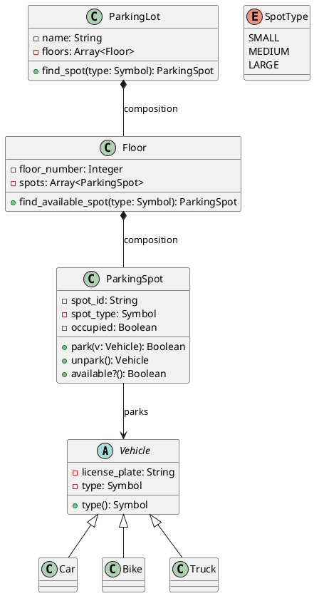
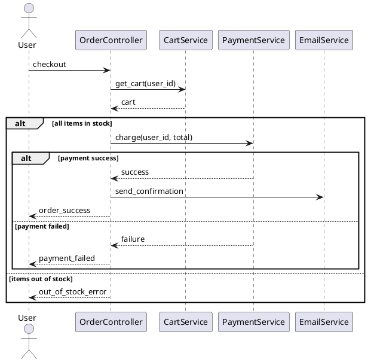
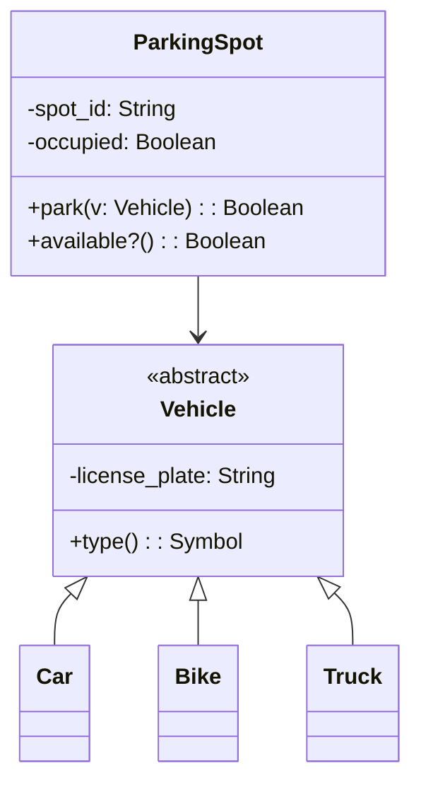

# Module 7: UML Diagrams & Modeling (Ruby)

> UML (Unified Modeling Language) is a standardized visual language for specifying, constructing, and documenting the artifacts of software systems. In Low-Level Design interviews, UML is the primary tool for communicating your design — you draw class diagrams to show structure, sequence diagrams to show behavior, and relationship lines to show how objects interact. Mastering UML means you can translate any design pattern, SOLID principle, or LLD problem into a clear, unambiguous visual representation. Ruby's dynamic nature, duck typing, modules, and mixins add unique considerations when mapping UML to code.

---

## 7.1 Class Diagrams

> A class diagram is the most commonly used UML diagram in LLD. It shows the static structure of a system — the classes, their attributes, methods, and the relationships between them. In an interview, this is the first thing you draw after gathering requirements.

---

### Why Class Diagrams?

Class diagrams answer the fundamental design questions:
- **What classes exist** in the system?
- **What data** does each class hold (attributes)?
- **What behavior** does each class expose (methods)?
- **How do classes relate** to each other?
- **What is the type hierarchy** (inheritance, modules, mixins)?

```
Without a class diagram:
"So there's a User class that has a name and email, and it can place orders,
and Order has items, and each item references a product, and products have
categories, and categories can be nested, and..."
→ Confusing, ambiguous, easy to miss relationships.

With a class diagram:
One picture shows ALL of this clearly, unambiguously, at a glance.
```

---

### Basic Class Notation

A class is represented as a rectangle divided into three compartments:

```
┌─────────────────────────────┐
│         ClassName           │  ← Name compartment
├─────────────────────────────┤
│ - privateAttr: Type         │  ← Attributes compartment
│ # protectedAttr: Type       │
│ + publicAttr: Type          │
├─────────────────────────────┤
│ + publicMethod(): RetType   │  ← Methods compartment
│ - privateMethod(): void     │
│ # protectedMethod(): Type   │
└─────────────────────────────┘
```

---

### Classes, Attributes, Methods

**Attributes** represent the data a class holds. **Methods** represent the behavior a class exposes.

```
┌──────────────────────────────────────┐
│              BankAccount             │
├──────────────────────────────────────┤
│ - account_number: String             │
│ - balance: Float                     │
│ - owner_name: String                 │
│ - account_type: Symbol               │
│ - active: Boolean                    │
│ - created_at: Time                   │
├──────────────────────────────────────┤
│ + deposit(amount: Float): Boolean    │
│ + withdraw(amount: Float): Boolean   │
│ + balance(): Float                   │
│ + transfer(to: BankAccount,          │
│            amount: Float): Boolean   │
│ + statement(from: Date,              │
│             to: Date): Statement     │
│ - validate_amount(amount: Float): Boolean │
│ - log_transaction(t: Transaction): void   │
└──────────────────────────────────────┘
```

**Attribute syntax:** `visibility name: Type [= defaultValue]`
**Method syntax:** `visibility name(param: Type, ...): ReturnType`

```ruby
# The above class diagram translates to this Ruby code:
class BankAccount
  attr_reader :balance, :account_number

  def initialize(account_number, owner_name, account_type, balance: 0.0)
    @account_number = account_number
    @balance = balance
    @owner_name = owner_name
    @account_type = account_type  # :checking, :savings, etc.
    @active = true
    @created_at = Time.now
  end

  def deposit(amount)
    return false unless validate_amount(amount)

    @balance += amount
    true
  end

  def withdraw(amount)
    return false unless validate_amount(amount)
    return false if @balance < amount

    @balance -= amount
    true
  end

  def transfer(to, amount)
    return false unless withdraw(amount)

    to.deposit(amount)
  end

  def statement(from_date, to_date)
    # Build and return a Statement object for the date range
  end

  private

  def validate_amount(amount)
    amount.is_a?(Numeric) && amount > 0
  end

  def log_transaction(transaction)
    # Log the transaction details
  end
end
```

---

### Visibility (Access Specifiers)

UML uses symbols to denote access levels:

| Symbol | Visibility | Ruby Keyword | Meaning |
|--------|-----------|-------------|---------|
| `+` | Public | `public` (default) | Accessible from anywhere |
| `-` | Private | `private` | Accessible only within the class |
| `#` | Protected | `protected` | Accessible within the class and subclasses |
| `~` | Package | (no direct Ruby equivalent) | Accessible within the same module/namespace |

```
┌──────────────────────────────────┐
│            Employee              │
├──────────────────────────────────┤
│ - id: Integer                    │  ← private (instance variable)
│ - name: String                   │  ← private (instance variable)
│ # department: String             │  ← protected (subclasses can access)
│ + email: String                  │  ← public (attr_accessor)
├──────────────────────────────────┤
│ + name(): String                 │  ← public (attr_reader)
│ + name=(n: String): void         │  ← public (attr_writer)
│ # calculate_bonus(): Float       │  ← protected
│ - validate_email(e: String): Boolean │  ← private
└──────────────────────────────────┘
```

```ruby
class Employee
  attr_accessor :email
  attr_reader :name

  def initialize(id, name, department, email)
    @id = id
    @name = name
    @department = department
    @email = email
  end

  def name=(new_name)
    @name = new_name
  end

  protected

  attr_reader :department

  def calculate_bonus
    # Subclasses can call this
    0.0
  end

  private

  def validate_email(email)
    email.match?(/\A[\w+\-.]+@[a-z\d\-]+(\.[a-z\d\-]+)*\.[a-z]+\z/i)
  end
end
```

**Ruby-specific note:** In Ruby, all instance variables (`@var`) are private by default. Visibility keywords (`public`, `private`, `protected`) control method access. `attr_reader`, `attr_writer`, and `attr_accessor` generate public methods to access instance variables. Ruby's `protected` allows access from instances of the same class or subclasses, unlike some other languages.

---

### Static Members (Underlined)

Static members belong to the class itself, not to any instance. In UML, they are shown **underlined**. In Ruby, these are class-level methods and variables.

```
┌──────────────────────────────────┐
│           Singleton              │
├──────────────────────────────────┤
│ - instance: Singleton            │  ← underlined = static (class variable)
│ - data: String                   │
├──────────────────────────────────┤
│ + instance(): Singleton          │  ← underlined = static (class method)
│ + data(): String                 │
│ - initialize()                   │  ← private constructor
└──────────────────────────────────┘
```

In text-based UML (interviews on whiteboards), you can denote static with an underline or by writing `{static}`:

```
- instance: Singleton {static}
+ instance(): Singleton {static}
```

```ruby
require 'singleton'

class AppConfig
  include Singleton

  attr_reader :data

  def initialize
    @data = {}
  end

  def set(key, value)
    @data[key] = value
  end

  def get(key)
    @data[key]
  end
end

# Usage
config = AppConfig.instance
config.set(:app_name, "MyApp")
config.get(:app_name)  # => "MyApp"

# Or without the Singleton module — manual implementation:
class Logger
  @instance = nil

  class << self
    def instance
      @instance ||= new
    end

    private :new  # Make new private
  end

  attr_reader :data

  def initialize
    @data = ""
  end
end
```

**Other common notations for static:**
- Some tools use prefix: `$instance`, `$getInstance()`
- In PlantUML: `{static}` keyword
- On whiteboards: underline or write "(static)" next to it

---

### Abstract Classes and Methods (Italics)

Abstract classes (classes that cannot be instantiated directly) and abstract methods are shown in *italics* in UML. On a whiteboard, you can write `{abstract}` or use `<<abstract>>`. Ruby doesn't have built-in abstract classes, but the convention is to raise `NotImplementedError`.

```
┌──────────────────────────────────┐
│        «abstract»                │
│          Shape                   │  ← italic name = abstract class
├──────────────────────────────────┤
│ # x: Integer                    │
│ # y: Integer                    │
│ # color: String                 │
├──────────────────────────────────┤
│ + draw(): void {abstract}       │  ← italic = abstract method
│ + area(): Float {abstract}      │  ← italic = abstract method
│ + move_to(x: Integer,           │
│           y: Integer): void     │  ← concrete method
│ + color(): String               │  ← concrete method
└──────────────────────────────────┘
         ▲
         │ (inheritance)
    ┌────┴─────┐
    │          │
┌───┴───┐ ┌───┴────┐
│Circle │ │Rectangle│  ← concrete classes
└───────┘ └────────┘
```

```ruby
class Shape
  attr_reader :color

  def initialize(x, y, color)
    raise NotImplementedError, "#{self.class} is abstract" if self.class == Shape

    @x = x
    @y = y
    @color = color
  end

  def draw
    raise NotImplementedError, "#{self.class}#draw not implemented"
  end

  def area
    raise NotImplementedError, "#{self.class}#area not implemented"
  end

  def move_to(x, y)
    @x = x
    @y = y
  end

  protected

  attr_reader :x, :y
end

class Circle < Shape
  def initialize(x, y, color, radius)
    super(x, y, color)
    @radius = radius
  end

  def draw
    puts "Drawing circle at (#{x}, #{y}) with radius #{@radius}"
  end

  def area
    Math::PI * @radius**2
  end
end

class Rectangle < Shape
  def initialize(x, y, color, width, height)
    super(x, y, color)
    @width = width
    @height = height
  end

  def draw
    puts "Drawing rectangle at (#{x}, #{y}) #{@width}x#{@height}"
  end

  def area
    @width * @height
  end
end
```

---

### Interfaces (Modules / Duck Typing)

In UML, interfaces are shown with the `<<interface>>` stereotype. Ruby doesn't have formal interfaces — instead, it uses **modules** (mixins) and **duck typing**. A module with methods that raise `NotImplementedError` acts as an interface contract.

```
┌──────────────────────────────────┐
│        «interface»               │
│         Printable                │
├──────────────────────────────────┤
│                                  │  ← no attributes (typically)
├──────────────────────────────────┤
│ + print_out(): void              │
│ + to_s(): String                 │
└──────────────────────────────────┘

┌──────────────────────────────────┐
│        «interface»               │
│         Serializable             │
├──────────────────────────────────┤
│                                  │
├──────────────────────────────────┤
│ + serialize(): String            │
│ + deserialize(data: String): void│
└──────────────────────────────────┘
```

```ruby
# Ruby "interface" via module — defines the contract
module Printable
  def print_out
    raise NotImplementedError, "#{self.class}#print_out not implemented"
  end

  def to_s
    raise NotImplementedError, "#{self.class}#to_s not implemented"
  end
end

module Serializable
  def serialize
    raise NotImplementedError, "#{self.class}#serialize not implemented"
  end

  def deserialize(data)
    raise NotImplementedError, "#{self.class}#deserialize not implemented"
  end
end

# A class "implements" interfaces by including modules
class Report
  include Printable
  include Serializable

  attr_reader :title, :content

  def initialize(title, content)
    @title = title
    @content = content
  end

  def print_out
    puts "=== #{@title} ===\n#{@content}"
  end

  def to_s
    "Report: #{@title}"
  end

  def serialize
    { title: @title, content: @content }.to_json
  end

  def deserialize(data)
    parsed = JSON.parse(data)
    @title = parsed["title"]
    @content = parsed["content"]
  end
end
```

**Ruby-specific UML considerations:**
- Use `<<module>>` or `<<mixin>>` stereotype for Ruby modules in UML diagrams
- Duck typing means a class can satisfy an "interface" without explicitly including a module — if it responds to the right methods, it works
- Multiple modules can be included (Ruby's answer to multiple interface implementation)

---

### Enumerations

Ruby doesn't have a built-in `enum` type. Enums are typically represented as constants, symbols, or frozen arrays/hashes. In UML, they are still shown with the `<<enumeration>>` stereotype:

```
┌──────────────────────────────────┐
│       «enumeration»              │
│        OrderStatus               │
├──────────────────────────────────┤
│ PENDING                          │
│ CONFIRMED                        │
│ SHIPPED                          │
│ DELIVERED                        │
│ CANCELLED                        │
└──────────────────────────────────┘
```

```ruby
# Approach 1: Module with constants (most common)
module OrderStatus
  PENDING   = :pending
  CONFIRMED = :confirmed
  SHIPPED   = :shipped
  DELIVERED = :delivered
  CANCELLED = :cancelled

  ALL = [PENDING, CONFIRMED, SHIPPED, DELIVERED, CANCELLED].freeze

  def self.valid?(status)
    ALL.include?(status)
  end
end

# Approach 2: Frozen hash for value mapping
ORDER_STATUS = {
  pending:   0,
  confirmed: 1,
  shipped:   2,
  delivered: 3,
  cancelled: 4
}.freeze

# Approach 3: Simple symbols (duck typing style)
# Just use :pending, :confirmed, :shipped, etc. directly
class Order
  VALID_STATUSES = %i[pending confirmed shipped delivered cancelled].freeze

  def initialize
    @status = :pending
  end

  def status=(new_status)
    raise ArgumentError, "Invalid status" unless VALID_STATUSES.include?(new_status)

    @status = new_status
  end
end
```

---

### Complete Class Diagram Example — E-Commerce System

Here's how a real class diagram looks for a small system:

```
┌──────────────────────┐       ┌──────────────────────┐
│        User          │       │    «enumeration»     │
├──────────────────────┤       │     OrderStatus      │
│ - id: Integer        │       ├──────────────────────┤
│ - name: String       │       │ PENDING              │
│ - email: String      │       │ CONFIRMED            │
│ - password: String   │       │ SHIPPED              │
├──────────────────────┤       │ DELIVERED            │
│ + register(): Boolean│       │ CANCELLED            │
│ + login(): Boolean   │       └──────────────────────┘
│ + place_order(): Order│
│ + orders(): Array    │
└──────────┬───────────┘
           │ 1
           │ places
           │ *
┌──────────┴───────────┐       ┌──────────────────────┐
│       Order          │       │      Product         │
├──────────────────────┤       ├──────────────────────┤
│ - order_id: Integer  │       │ - product_id: Integer│
│ - order_date: Time   │       │ - name: String       │
│ - status: Symbol     │       │ - price: Float       │
│ - total_amount: Float│       │ - stock: Integer     │
├──────────────────────┤       ├──────────────────────┤
│ + add_item(): void   │       │ + price(): Float     │
│ + remove_item(): void│       │ + in_stock?(): Boolean│
│ + calculate_total()  │       │ + reduce_stock(): void│
│   : Float            │       └──────────┬───────────┘
│ + cancel(): Boolean  │                  │
└──────────┬───────────┘                  │ 1
           │ 1                            │
           │ contains                     │
           │ *                            │
┌──────────┴───────────┐                  │
│     OrderItem        │──────────────────┘
├──────────────────────┤    references
│ - quantity: Integer  │
│ - unit_price: Float  │
├──────────────────────┤
│ + subtotal(): Float  │
└──────────────────────┘
```

```ruby
class User
  attr_reader :id, :name, :email, :orders

  def initialize(id, name, email, password)
    @id = id
    @name = name
    @email = email
    @password = password
    @orders = []
  end

  def register
    # Registration logic
    true
  end

  def login(email, password)
    @email == email && @password == password
  end

  def place_order
    order = Order.new(self)
    @orders << order
    order
  end
end

class Order
  attr_reader :order_id, :order_date, :status, :items

  @@next_id = 1

  def initialize(user)
    @order_id = @@next_id
    @@next_id += 1
    @order_date = Time.now
    @status = :pending
    @items = []
    @user = user
  end

  def add_item(product, quantity)
    item = OrderItem.new(product, quantity)
    @items << item
  end

  def remove_item(product)
    @items.reject! { |item| item.product == product }
  end

  def calculate_total
    @items.sum(&:subtotal)
  end

  def cancel
    return false unless @status == :pending

    @status = :cancelled
    true
  end
end

class OrderItem
  attr_reader :product, :quantity, :unit_price

  def initialize(product, quantity)
    @product = product
    @quantity = quantity
    @unit_price = product.price
  end

  def subtotal
    @quantity * @unit_price
  end
end

class Product
  attr_reader :product_id, :name, :price, :stock

  def initialize(product_id, name, price, stock)
    @product_id = product_id
    @name = name
    @price = price
    @stock = stock
  end

  def in_stock?
    @stock > 0
  end

  def reduce_stock(quantity = 1)
    raise "Insufficient stock" if @stock < quantity

    @stock -= quantity
  end
end
```

This single diagram communicates:
- What classes exist and their responsibilities
- What data each class holds
- What operations each class supports
- How classes relate (User places Orders, Orders contain OrderItems, OrderItems reference Products)
- Multiplicity (one User has many Orders, one Order has many OrderItems)

---


## 7.2 Relationships

> Relationships are the lines between classes in a UML diagram. They show how classes are connected — who uses whom, who owns whom, who inherits from whom. Getting relationships right is critical in LLD interviews because they directly map to code structure (inheritance, composition, references, etc.).

---

### Overview of All Relationship Types

```
RELATIONSHIP          UML NOTATION              STRENGTH
─────────────────────────────────────────────────────────
Dependency            - - - - - - ->            Weakest
Association           ─────────────>
Aggregation           ────────────◇>
Composition           ────────────◆>
Inheritance           ─────────────▷            
Realization           - - - - - - ▷             Strongest
                                                (in terms of coupling)
```

| Relationship | Line Style | Arrow | Meaning | Ruby Mapping |
|-------------|-----------|-------|---------|-------------|
| Dependency | Dashed | Open arrow `-->` | "uses temporarily" | Method parameter, local variable |
| Association | Solid | Open arrow `-->` | "uses / knows about" | Instance variable reference |
| Aggregation | Solid | Open diamond `--◇` | "has-a (weak)" | Instance variable reference (shared) |
| Composition | Solid | Filled diamond `--◆` | "has-a (strong)" | Instance variable, created internally |
| Inheritance | Solid | Hollow triangle `--▷` | "is-a" | `class Child < Parent` |
| Realization | Dashed | Hollow triangle `--▷` | "implements" | `include ModuleName` |

---

### Association (Uses / Knows About)

An association means one class **knows about** and **uses** another class. It's a structural relationship — the reference is stored as an instance variable.

```
┌──────────┐           ┌──────────┐
│ Teacher  │──────────>│ Course   │
└──────────┘ teaches   └──────────┘
```

**Notation:** Solid line with optional arrow showing navigability (who knows about whom).

```ruby
# Unidirectional association: Teacher knows about Course
class Course
  attr_reader :name

  def initialize(name)
    @name = name
  end
end

class Teacher
  attr_reader :name, :courses

  def initialize(name)
    @name = name
    @courses = []
  end

  def teach(course)
    @courses << course
  end
end

# Teacher knows about Courses, but Course does NOT know about Teacher
```

```
// Bidirectional association: both know about each other
┌──────────┐           ┌──────────┐
│ Student  │<─────────>│ Course   │
└──────────┘ enrolls   └──────────┘
```

```ruby
# Bidirectional: both hold references
class Student
  attr_reader :name, :courses

  def initialize(name)
    @name = name
    @courses = []
  end

  def enroll(course)
    @courses << course
    course.add_student(self) unless course.students.include?(self)
  end
end

class Course
  attr_reader :name, :students

  def initialize(name)
    @name = name
    @students = []
  end

  def add_student(student)
    @students << student
    student.enroll(self) unless student.courses.include?(self)
  end
end
```

**Key characteristics:**
- Objects have independent lifecycles
- Either or both can exist without the other
- The relationship is stored as an instance variable

---

### Aggregation (Has-A, Weak Ownership)

Aggregation is a special form of association that represents a **"has-a"** relationship with **weak ownership**. The contained object can exist independently of the container.

```
┌──────────────┐           ┌──────────────┐
│  Department  │◇─────────>│   Employee   │
└──────────────┘ has       └──────────────┘
```

**Notation:** Solid line with an **open (hollow) diamond** on the container side.

```ruby
class Employee
  attr_reader :name, :id

  def initialize(name, id)
    @name = name
    @id = id
  end
end

class Department
  attr_reader :name, :employees

  def initialize(name)
    @name = name
    @employees = []
  end

  def add_employee(employee)
    @employees << employee
  end

  def remove_employee(employee)
    @employees.delete(employee)
  end

  # Department does NOT destroy employees when it's garbage collected!
  # Employees exist independently.
end

# Usage — employees exist independently of department
alice = Employee.new("Alice", 1)
bob = Employee.new("Bob", 2)

engineering = Department.new("Engineering")
engineering.add_employee(alice)
engineering.add_employee(bob)

engineering = nil  # Department garbage collected, but alice and bob still exist!

puts alice.name  # => "Alice" — still alive and valid
puts bob.name    # => "Bob"   — still alive and valid
```

**Key characteristics:**
- Container has a reference to the contained object
- Contained object can exist **without** the container
- Contained object can be **shared** among multiple containers
- Destroying the container does **NOT** destroy the contained objects
- Think: "Department has Employees, but Employees exist independently"

---

### Composition (Has-A, Strong Ownership)

Composition is a stronger form of aggregation that represents **strong ownership** with **lifecycle dependency**. The contained object cannot exist without the container — when the container is destroyed, the contained objects are destroyed too.

```
┌──────────────┐           ┌──────────────┐
│    House     │◆─────────>│     Room     │
└──────────────┘ has       └──────────────┘
```

**Notation:** Solid line with a **filled (solid) diamond** on the container side.

```ruby
class Room
  attr_reader :name, :area

  def initialize(name, area)
    @name = name
    @area = area
  end
end

class House
  attr_reader :address, :rooms

  def initialize(address)
    @address = address
    @rooms = []
  end

  def add_room(name, area)
    # House CREATES the Room — it owns it exclusively
    @rooms << Room.new(name, area)
  end

  def total_area
    @rooms.sum(&:area)
  end

  # When House is garbage collected, all Rooms are garbage collected too!
  # No external references to the Room objects exist.
end

# Usage
house = House.new("123 Main St")
house.add_room("Living Room", 30.0)
house.add_room("Bedroom", 20.0)
house.add_room("Kitchen", 15.0)

puts house.total_area  # => 65.0

house = nil  # House garbage collected → all Rooms garbage collected too!
# Rooms cannot exist without the House
```

**Key characteristics:**
- Container **owns** the contained objects exclusively
- Contained objects **cannot exist** without the container
- Contained objects are **NOT shared** — they belong to exactly one container
- Destroying the container **destroys** the contained objects
- Think: "House has Rooms — Rooms don't exist without a House"

**Ruby-specific note:** In Ruby, composition is enforced by convention rather than language features. The key pattern is: the container **creates** the parts internally (via `new` inside its own methods), and does **not** expose them for external sharing. Since Ruby uses garbage collection, "destruction" means the parts become unreachable when the container is unreachable.

---

### Aggregation vs Composition — The Critical Difference

This is one of the most frequently asked questions in LLD interviews:

| Aspect | Aggregation (◇) | Composition (◆) |
|--------|-----------------|-----------------|
| Ownership | Weak (shared) | Strong (exclusive) |
| Lifecycle | Independent | Dependent (part dies with whole) |
| Sharing | Part can belong to multiple wholes | Part belongs to exactly one whole |
| Destruction | Whole destroyed → parts survive | Whole destroyed → parts destroyed |
| Ruby implementation | Store external reference | Create internally, don't expose |
| UML symbol | Open diamond ◇ | Filled diamond ◆ |

**Examples to remember:**

| Relationship | Type | Why? |
|-------------|------|------|
| University → Professor | Aggregation ◇ | Professor exists without University |
| University → Department | Composition ◆ | Department doesn't exist without University |
| Car → Engine | Composition ◆ | Engine is built for this specific car |
| Car → Driver | Aggregation ◇ | Driver exists independently |
| Order → OrderItem | Composition ◆ | OrderItem has no meaning without Order |
| Order → Product | Aggregation ◇ | Product exists independently |
| Body → Heart | Composition ◆ | Heart doesn't exist without Body |
| Library → Book | Aggregation ◇ | Book exists independently of Library |
| Folder → File | Composition ◆ | File belongs to one Folder (in this model) |
| Playlist → Song | Aggregation ◇ | Song exists in multiple Playlists |

---

### Inheritance / Generalization (Is-A)

Inheritance represents an **"is-a"** relationship. The subclass inherits all attributes and methods of the superclass and can add or override them.

```
         ┌──────────────┐
         │    Animal     │
         ├──────────────┤
         │ # name: String│
         │ # age: Integer│
         ├──────────────┤
         │ + eat(): void │
         │ + sleep(): void│
         │ + speak(): void│
         │   {abstract}  │
         └──────┬───────┘
                ▲
                │ (inheritance — hollow triangle)
         ┌──────┴──────┐
         │             │
    ┌────┴────┐  ┌─────┴────┐
    │   Dog   │  │   Cat    │
    ├─────────┤  ├──────────┤
    │ - breed │  │ - indoor │
    ├─────────┤  ├──────────┤
    │ +speak()│  │ +speak() │
    │ +fetch()│  │ +purr()  │
    └─────────┘  └──────────┘
```

**Notation:** Solid line with a **hollow (open) triangle** pointing to the superclass.

```ruby
class Animal
  attr_reader :name, :age

  def initialize(name, age)
    raise NotImplementedError, "#{self.class} is abstract" if self.class == Animal

    @name = name
    @age = age
  end

  def eat
    puts "#{name} is eating"
  end

  def sleep
    puts "#{name} is sleeping"
  end

  def speak
    raise NotImplementedError, "#{self.class}#speak not implemented"
  end
end

class Dog < Animal
  attr_reader :breed

  def initialize(name, age, breed)
    super(name, age)
    @breed = breed
  end

  def speak
    puts "#{name} says: Woof!"
  end

  def fetch
    puts "#{name} fetches the ball"
  end
end

class Cat < Animal
  def initialize(name, age, indoor)
    super(name, age)
    @indoor = indoor
  end

  def speak
    puts "#{name} says: Meow!"
  end

  def purr
    puts "#{name} is purring"
  end

  def indoor?
    @indoor
  end
end
```

**Key characteristics:**
- Subclass inherits ALL public and protected methods from superclass
- Subclass can ADD new attributes and methods
- Subclass can OVERRIDE inherited methods
- Represents "is-a" relationship (Dog IS-A Animal)
- Arrow points FROM subclass TO superclass (child → parent)
- Ruby supports **single inheritance** only — one parent class per class

---

### Realization / Implementation (Includes Module)

Realization means a class **implements** an interface — it provides concrete implementations for all the abstract methods defined in the interface. In Ruby, this maps to **including a module**.

```
    ┌──────────────────┐
    │   «interface»    │
    │    Flyable       │
    ├──────────────────┤
    │ + fly(): void    │
    │ + land(): void   │
    └────────┬─────────┘
             ▲
             ┆ (realization — dashed line, hollow triangle)
        ┌────┴─────┐
        │          │
   ┌────┴───┐ ┌───┴────┐
   │ Eagle  │ │Airplane│
   └────────┘ └────────┘
```

**Notation:** **Dashed** line with a **hollow triangle** pointing to the interface.

The difference from inheritance:
- **Inheritance** (solid line): extends a class (inherits implementation)
- **Realization** (dashed line): implements an interface/module (contract fulfillment)

```ruby
# Interface as a module
module Flyable
  def fly
    raise NotImplementedError, "#{self.class}#fly not implemented"
  end

  def land
    raise NotImplementedError, "#{self.class}#land not implemented"
  end
end

# Realization — Eagle implements Flyable
class Eagle
  include Flyable

  def fly
    puts "Eagle soaring through the sky"
  end

  def land
    puts "Eagle landing on a branch"
  end
end

# Realization — Airplane implements Flyable
class Airplane
  include Flyable

  def fly
    puts "Airplane cruising at 35,000 feet"
  end

  def land
    puts "Airplane landing on runway"
  end
end
```

**In Ruby, the distinction between inheritance and realization is clear:**
- Inheritance: `class Child < Parent` (solid line in UML)
- Realization: `include ModuleName` (dashed line in UML)
- Ruby allows including **multiple modules** but only **one parent class** — this is Ruby's approach to multiple interface implementation

---

### Dependency (Uses Temporarily)

A dependency means one class **uses** another temporarily — typically as a method parameter, local variable, or return type. It's the **weakest** relationship.

```
┌──────────────┐           ┌──────────────┐
│ OrderService │- - - - ->│ EmailService │
└──────────────┘ uses      └──────────────┘
```

**Notation:** **Dashed** line with an **open arrow**.

```ruby
class EmailService
  def send_email(to, subject, body)
    puts "Sending email to #{to}: #{subject}"
  end
end

class OrderService
  # NO instance variable for EmailService — it's just used temporarily

  def process_order(order_id, email_service)
    # EmailService is a parameter — temporary usage
    puts "Processing order #{order_id}"
    email_service.send_email(
      "customer@example.com",
      "Order Confirmed",
      "Your order #{order_id} is confirmed."
    )
  end
end

# Usage
email_svc = EmailService.new
order_svc = OrderService.new
order_svc.process_order("ORD-123", email_svc)
```

**Key characteristics:**
- No instance variable — the used class appears only in method signatures or local scope
- Weakest relationship — changing the used class has minimal impact
- Shown as a dashed arrow
- Think: "OrderService uses EmailService, but doesn't hold a reference to it"

**Dependency vs Association:**

| Aspect | Dependency (dashed) | Association (solid) |
|--------|-------------------|-------------------|
| Duration | Temporary (method scope) | Persistent (object lifetime) |
| Storage | Parameter, local variable | Instance variable |
| Coupling | Weaker | Stronger |
| Example | `def process(logger)` | `@logger = logger` (instance var) |

---

### Multiplicity

Multiplicity specifies **how many instances** of one class relate to instances of another class. It's written near the ends of relationship lines.

```
┌──────────┐  1      *  ┌──────────┐
│ Customer │────────────>│  Order   │
└──────────┘             └──────────┘
"One Customer has zero or more Orders"

┌──────────┐  1      1  ┌──────────┐
│  Person  │────────────>│ Passport │
└──────────┘             └──────────┘
"One Person has exactly one Passport"

┌──────────┐  *      *  ┌──────────┐
│ Student  │────────────>│  Course  │
└──────────┘             └──────────┘
"Many Students enroll in many Courses"
```

**Common multiplicity notations:**

| Notation | Meaning | Example |
|----------|---------|---------|
| `1` | Exactly one | Person → Passport |
| `0..1` | Zero or one (optional) | Employee → ParkingSpot |
| `*` or `0..*` | Zero or more | Customer → Order |
| `1..*` | One or more (at least one) | Order → OrderItem |
| `2..5` | Between 2 and 5 | Team → Player (basketball) |
| `n` | Exactly n | Bicycle → Wheel (2) |

```ruby
# 1 to * (one-to-many)
class Customer
  attr_reader :orders

  def initialize(name)
    @name = name
    @orders = []  # 0 or more orders
  end
end

# 1 to 1 (one-to-one)
class Person
  attr_reader :passport

  def initialize(name, passport)
    @name = name
    @passport = passport  # exactly one
  end
end

# * to * (many-to-many)
class Student
  attr_reader :courses

  def initialize(name)
    @name = name
    @courses = []  # many courses
  end
end

class Course
  attr_reader :students

  def initialize(name)
    @name = name
    @students = []  # many students
  end
end

# 1 to 0..1 (optional)
class Employee
  attr_reader :parking_spot

  def initialize(name)
    @name = name
    @parking_spot = nil  # may or may not have one
  end

  def assign_parking(spot)
    @parking_spot = spot
  end
end
```

---

### Complete Relationship Example — Library System

Putting all relationships together in one diagram:

```
┌──────────────────┐
│   «interface»    │
│   Searchable     │
├──────────────────┤
│ + search(query:  │
│   String): Array │
└────────┬─────────┘
         ▲
         ┆ realization (dashed, hollow triangle)
         ┆
┌────────┴─────────┐  1    *  ┌──────────────────┐
│     Library      │◆────────>│    Section       │
├──────────────────┤          ├──────────────────┤
│ - name: String   │          │ - name: String   │
│ - address: String│          │ - floor: Integer │
├──────────────────┤          └──────────────────┘
│ + search(): Array│               composition (filled diamond)
│ + add_book(): void│              Section can't exist without Library
└──────┬───────────┘
       │
       │ 1    *
       │◇──────────────────────┐
       │  aggregation          │
       │  (open diamond)       │
       │                       ▼
       │              ┌──────────────────┐
       │              │      Book        │
       │              ├──────────────────┤
       │              │ - isbn: String   │
       │              │ - title: String  │
       │              │ - author: String │
       │              ├──────────────────┤
       │              │ + info(): String │
       │              └──────────────────┘
       │                       ▲
       │                       │ inheritance (solid, hollow triangle)
       │              ┌────────┴────────┐
       │              │                 │
       │        ┌─────┴──────┐  ┌──────┴──────┐
       │        │  EBook     │  │ PhysicalBook│
       │        ├────────────┤  ├─────────────┤
       │        │-file_size  │  │-weight      │
       │        │-format     │  │-pages       │
       │        └────────────┘  └─────────────┘
       │
       │ 1    *
       │──────────────────────>┌──────────────────┐
       │  association          │     Member       │
       │                       ├──────────────────┤
       │                       │ - name: String   │
       │                       │ - member_id: Integer│
       │                       ├──────────────────┤
       │                       │ + borrow(): void │
       │                       │ + return_book(): void│
       │                       └──────┬───────────┘
       │                              │
       │                              │ dependency (dashed arrow)
       │                              ▼
       │                       ┌──────────────────┐
       │                       │  FineCalculator  │
       │                       ├──────────────────┤
       │                       │ + calculate(     │
       │                       │   days: Integer):│
       │                       │   Float          │
       │                       └──────────────────┘
```

```ruby
# Interface (module)
module Searchable
  def search(query)
    raise NotImplementedError, "#{self.class}#search not implemented"
  end
end

# Realization — Library implements Searchable
class Library
  include Searchable

  attr_reader :name

  def initialize(name, address)
    @name = name
    @address = address
    @sections = []  # Composition: Library creates and owns Sections
    @books = []     # Aggregation: Library references Books
    @members = []   # Association: Library knows about Members
  end

  def add_section(name, floor)
    @sections << Section.new(name, floor)  # Created internally = composition
  end

  def add_book(book)
    @books << book  # External reference = aggregation
  end

  def register_member(member)
    @members << member
  end

  def search(query)
    @books.select { |book| book.title.downcase.include?(query.downcase) }
  end
end

# Composition: Section can't exist without Library
class Section
  attr_reader :name, :floor

  def initialize(name, floor)
    @name = name
    @floor = floor
  end
end

# Aggregation: Book exists independently
class Book
  attr_reader :isbn, :title, :author

  def initialize(isbn, title, author)
    @isbn = isbn
    @title = title
    @author = author
  end

  def info
    "#{title} by #{author} (ISBN: #{isbn})"
  end
end

# Inheritance
class EBook < Book
  attr_reader :file_size, :format

  def initialize(isbn, title, author, file_size, format)
    super(isbn, title, author)
    @file_size = file_size
    @format = format
  end
end

class PhysicalBook < Book
  attr_reader :weight, :pages

  def initialize(isbn, title, author, weight, pages)
    super(isbn, title, author)
    @weight = weight
    @pages = pages
  end
end

# Association: Member knows about Library
class Member
  attr_reader :name, :member_id

  def initialize(name, member_id)
    @name = name
    @member_id = member_id
    @borrowed_books = []
  end

  def borrow(book)
    @borrowed_books << { book: book, date: Time.now }
  end

  def return_book(book)
    record = @borrowed_books.find { |r| r[:book] == book }
    return unless record

    @borrowed_books.delete(record)
    days_late = ((Time.now - record[:date]) / 86_400).to_i - 14
    FineCalculator.calculate(days_late) if days_late > 0
  end
end

# Dependency: Member uses FineCalculator temporarily
class FineCalculator
  DAILY_RATE = 0.50

  def self.calculate(days_overdue)
    days_overdue * DAILY_RATE
  end
end
```

**Reading this diagram:**
- Library **implements** Searchable (realization — `include Searchable`)
- Library **is composed of** Sections (composition — sections die with library)
- Library **aggregates** Books (aggregation — books can exist independently)
- Library **is associated with** Members (association)
- Member **depends on** FineCalculator (dependency — uses temporarily)
- EBook and PhysicalBook **inherit from** Book (inheritance)

---

### Relationship Decision Guide

When deciding which relationship to use, ask these questions in order:

```
1. Does class A inherit from class B?
   YES → Is B a module/interface (all abstract)?
         YES → Realization (dashed, hollow triangle) — include Module
         NO  → Inheritance (solid, hollow triangle) — class A < B

2. Does class A contain class B?
   YES → Does B exist independently of A?
         YES → Aggregation (open diamond ◇)
         NO  → Composition (filled diamond ◆)

3. Does class A hold a persistent reference to class B?
   YES → Association (solid line)

4. Does class A use class B only temporarily?
   YES → Dependency (dashed line)
```

---


## 7.3 Sequence Diagrams

> Sequence diagrams show how objects interact over time. They capture the **order of messages** exchanged between objects to accomplish a specific task. While class diagrams show static structure, sequence diagrams show dynamic behavior — they answer "what happens when the user clicks Buy?"

---

### Why Sequence Diagrams?

Class diagrams show WHAT exists. Sequence diagrams show HOW things work:

```
Class Diagram tells you:
  "OrderService has a method process_order and depends on PaymentService"

Sequence Diagram tells you:
  "When process_order is called, it first validates the cart, then calls
   PaymentService.charge, then calls InventoryService.reserve, then
   calls EmailService.send_confirmation, in that exact order"
```

In LLD interviews, you typically draw:
1. A class diagram (structure)
2. One or two sequence diagrams for key flows (behavior)

---

### Basic Elements

```
  ┌───────┐          ┌───────┐          ┌───────┐
  │ User  │          │ Server│          │  DB   │
  └───┬───┘          └───┬───┘          └───┬───┘
      │                  │                  │
      │   Lifeline       │   Lifeline       │   Lifeline
      │   (dashed         │                  │
      │    vertical       │                  │
      │    line)          │                  │
      │                  │                  │
      ▼                  ▼                  ▼
```

| Element | Description | Notation |
|---------|-------------|----------|
| **Object/Participant** | An instance involved in the interaction | Rectangle at the top |
| **Lifeline** | The time axis for an object | Dashed vertical line below the object |
| **Activation bar** | Period when an object is active/processing | Thin rectangle on the lifeline |
| **Message** | Communication between objects | Arrow between lifelines |
| **Return message** | Response to a message | Dashed arrow going back |

---

### Lifelines and Activation Bars

A **lifeline** represents the existence of an object over time (top to bottom). An **activation bar** (thin rectangle on the lifeline) shows when the object is actively processing.

```
  ┌────────┐                    ┌────────┐
  │ Client │                    │ Server │
  └───┬────┘                    └───┬────┘
      │                             │
      │    request()                │
      │────────────────────────────>│
      │                             │
      │                          ┌──┴──┐  ← activation bar
      │                          │     │     (Server is processing)
      │                          │     │
      │    response               │     │
      │<─ ─ ─ ─ ─ ─ ─ ─ ─ ─ ─ ─┤     │  ← dashed = return
      │                          └──┬──┘  ← processing complete
      │                             │
```

**Activation bar rules:**
- Starts when the object receives a message
- Ends when the object returns/finishes processing
- Can be nested (object calls itself — recursion)
- Shows the "call stack" visually

---

### Synchronous vs Asynchronous Messages

**Synchronous message:** The sender waits for the receiver to finish before continuing. Shown with a **filled arrowhead**.

**Asynchronous message:** The sender continues immediately without waiting. Shown with an **open arrowhead**.

```
  ┌────────┐          ┌────────┐          ┌────────┐
  │ Client │          │ Server │          │ Logger │
  └───┬────┘          └───┬────┘          └───┬────┘
      │                   │                   │
      │  process_order    │                   │
      │──────────────────>│                   │  ← synchronous (filled arrow)
      │                   │                   │     Client WAITS
      │                   │  log("order")     │
      │                   │ ─ ─ ─ ─ ─ ─ ─ ─ >│  ← asynchronous (open arrow)
      │                   │                   │     Server does NOT wait
      │                   │                   │
      │                   │  do_processing    │
      │                   │────┐              │
      │                   │    │ self-call    │
      │                   │<───┘              │
      │                   │                   │
      │   result          │                   │
      │<─ ─ ─ ─ ─ ─ ─ ─ ─│                   │  ← return message (dashed)
      │                   │                   │
```

| Message Type | Arrow Style | Sender Behavior | Example |
|-------------|------------|-----------------|---------|
| Synchronous | `──────>` (filled) | Waits for response | Method call, HTTP request |
| Asynchronous | `─ ─ ─ >` (open) | Continues immediately | Fire-and-forget, background job |
| Return | `<─ ─ ─ ─` (dashed) | Response to sync call | Return value |
| Self-call | `──┐` then `<──┘` | Object calls itself | Recursion, private method |

---

### Return Messages

Return messages show the response flowing back to the caller. They are **dashed arrows** going in the opposite direction.

```
  ┌────────┐          ┌────────────┐          ┌──────────┐
  │ Client │          │ UserService│          │ Database │
  └───┬────┘          └─────┬──────┘          └────┬─────┘
      │                     │                      │
      │  find_user(id: 42)  │                      │
      │────────────────────>│                      │
      │                     │                      │
      │                     │  SELECT * FROM users │
      │                     │  WHERE id=42         │
      │                     │─────────────────────>│
      │                     │                      │
      │                     │  ResultSet(row data) │
      │                     │<─ ─ ─ ─ ─ ─ ─ ─ ─ ─│
      │                     │                      │
      │  User(id: 42,       │                      │
      │       name: "Alice")│                      │
      │<─ ─ ─ ─ ─ ─ ─ ─ ─ ─│                      │
      │                     │                      │
```

```ruby
# The sequence diagram above maps to this Ruby code:
class UserService
  def initialize(database)
    @database = database
  end

  def find_user(id)
    row = @database.query("SELECT * FROM users WHERE id = ?", id)
    User.new(id: row[:id], name: row[:name])
  end
end

# Client code
service = UserService.new(database)
user = service.find_user(42)  # Synchronous call, waits for result
```

**Convention:** Return messages are optional in UML — you can omit them if the return is obvious. But in interviews, showing them makes the flow clearer.

---

### Loops, Conditions, and Fragments

UML sequence diagrams use **combined fragments** to show control flow (loops, conditions, optional behavior).

#### Loop Fragment

```
  ┌────────┐          ┌────────────┐
  │ Client │          │ ItemService│
  └───┬────┘          └─────┬──────┘
      │                     │
      │  ┌─────────────────────────────┐
      │  │ loop [for each item in cart]│
      │  │                             │
      │  │  validate_item(item)        │
      │  │────────────────────────────>│
      │  │                             │
      │  │  valid: Boolean             │
      │  │<─ ─ ─ ─ ─ ─ ─ ─ ─ ─ ─ ─ ─│
      │  │                             │
      │  └─────────────────────────────┘
      │                     │
```

```ruby
# Ruby code for the loop fragment
class CartValidator
  def initialize(item_service)
    @item_service = item_service
  end

  def validate_cart(cart)
    cart.items.each do |item|
      valid = @item_service.validate_item(item)
      return false unless valid
    end
    true
  end
end
```

#### Alt (If-Else) Fragment

```
  ┌────────┐          ┌────────────┐          ┌──────────┐
  │ Client │          │ AuthService│          │ Database │
  └───┬────┘          └─────┬──────┘          └────┬─────┘
      │                     │                      │
      │  login(user, pass)  │                      │
      │────────────────────>│                      │
      │                     │                      │
      │                     │  find_user(user)     │
      │                     │─────────────────────>│
      │                     │                      │
      │                     │  user_data           │
      │                     │<─ ─ ─ ─ ─ ─ ─ ─ ─ ─│
      │                     │                      │
      │  ┌──────────────────────────────────────────┐
      │  │ alt [password matches]                   │
      │  │                                          │
      │  │  login_success(token)                    │
      │  │<─ ─ ─ ─ ─ ─ ─ ─ ─│                      │
      │  │                                          │
      │  ├──────────────────────────────────────────┤
      │  │ [else: password doesn't match]           │
      │  │                                          │
      │  │  login_failed("Invalid credentials")     │
      │  │<─ ─ ─ ─ ─ ─ ─ ─ ─│                      │
      │  │                                          │
      │  └──────────────────────────────────────────┘
      │                     │                      │
```

```ruby
class AuthService
  def initialize(database)
    @database = database
  end

  def login(username, password)
    user_data = @database.find_user(username)
    return { success: false, error: "User not found" } unless user_data

    if user_data[:password] == hash_password(password)
      token = generate_token(user_data)
      { success: true, token: token }
    else
      { success: false, error: "Invalid credentials" }
    end
  end

  private

  def hash_password(password)
    Digest::SHA256.hexdigest(password)
  end

  def generate_token(user_data)
    SecureRandom.hex(32)
  end
end
```

#### Opt (Optional) Fragment

```
  ┌────────┐          ┌────────────┐          ┌──────────┐
  │ Client │          │OrderService│          │EmailSvc  │
  └───┬────┘          └─────┬──────┘          └────┬─────┘
      │                     │                      │
      │  place_order(order) │                      │
      │────────────────────>│                      │
      │                     │                      │
      │  ┌──────────────────────────────────────────┐
      │  │ opt [customer has email]                 │
      │  │                                          │
      │  │                  │  send_confirmation()  │
      │  │                  │─────────────────────>│
      │  │                  │                      │
      │  └──────────────────────────────────────────┘
      │                     │                      │
      │  order_confirmed    │                      │
      │<─ ─ ─ ─ ─ ─ ─ ─ ─ ─│                      │
      │                     │                      │
```

```ruby
class OrderService
  def initialize(email_service)
    @email_service = email_service
  end

  def place_order(order)
    # Process the order...
    order.confirm!

    # Optional: send email only if customer has email
    if order.customer.email
      @email_service.send_confirmation(order)
    end

    order
  end
end
```

**Summary of fragments:**

| Fragment | Keyword | Meaning | Ruby Equivalent |
|----------|---------|---------|----------------|
| `alt` | Alternative | If-else | `if ... else ... end` |
| `opt` | Optional | If (no else) | `if ... end` |
| `loop` | Loop | Repeat | `.each`, `while`, `loop` |
| `par` | Parallel | Concurrent execution | `Thread.new`, async |
| `break` | Break | Exit the enclosing fragment | `break`, `return` |
| `ref` | Reference | Refers to another sequence diagram | Method call to another diagram |

---

### Complete Sequence Diagram — Online Order Flow

```
  ┌──────┐    ┌───────────┐    ┌──────────┐    ┌─────────┐    ┌─────────┐    ┌──────────┐
  │ User │    │ OrderCtrl │    │ CartSvc  │    │ PaySvc  │    │ InvSvc  │    │ EmailSvc │
  └──┬───┘    └─────┬─────┘    └────┬─────┘    └────┬────┘    └────┬────┘    └────┬─────┘
     │              │               │               │              │              │
     │ checkout     │               │               │              │              │
     │─────────────>│               │               │              │              │
     │              │               │               │              │              │
     │              │ get_cart(uid) │               │              │              │
     │              │──────────────>│               │              │              │
     │              │               │               │              │              │
     │              │ cart           │               │              │              │
     │              │<─ ─ ─ ─ ─ ─ ─ │               │              │              │
     │              │               │               │              │              │
     │              │ ┌─────────────────────────────────────────────┐              │
     │              │ │ loop [for each item in cart]                │              │
     │              │ │                                             │              │
     │              │ │ check_stock(item_id, qty)                   │              │
     │              │ │────────────────────────────────────────────>│              │
     │              │ │                                             │              │
     │              │ │ available: Boolean                          │              │
     │              │ │<─ ─ ─ ─ ─ ─ ─ ─ ─ ─ ─ ─ ─ ─ ─ ─ ─ ─ ─ ─│              │
     │              │ │                                             │              │
     │              │ └─────────────────────────────────────────────┘              │
     │              │               │               │              │              │
     │              │ ┌──────────────────────────────────────────────────────────────┐
     │              │ │ alt [all items in stock]                                    │
     │              │ │                                                             │
     │              │ │ charge(user_id, total)       │              │              │
     │              │ │────────────────────────────>│              │              │
     │              │ │                              │              │              │
     │              │ │ ┌────────────────────────────────────────────────────────────┐
     │              │ │ │ alt [payment success]                                     │
     │              │ │ │                                                            │
     │              │ │ │ reserve_items(cart)         │              │              │
     │              │ │ │──────────────────────────────────────────>│              │
     │              │ │ │                                           │              │
     │              │ │ │ reserved: Boolean                         │              │
     │              │ │ │<─ ─ ─ ─ ─ ─ ─ ─ ─ ─ ─ ─ ─ ─ ─ ─ ─ ─ ─│              │
     │              │ │ │                                                          │
     │              │ │ │ send_confirmation(user_id, order_id)                     │
     │              │ │ │─────────────────────────────────────────────────────────>│
     │              │ │ │                                                          │
     │              │ │ │ order_success                                            │
     │              │ │ │<─ ─ ─ ─ ─ ─ ─ ─│                                        │
     │              │ │ │                                                          │
     │              │ │ ├──────────────────────────────────────────────────────────┤
     │              │ │ │ [else: payment failed]                                   │
     │              │ │ │                                                          │
     │              │ │ │ payment_failed(reason)                                   │
     │              │ │ │<─ ─ ─ ─ ─ ─ ─ ─│                                        │
     │              │ │ │                                                          │
     │              │ │ └────────────────────────────────────────────────────────────┘
     │              │ │                                                             │
     │              │ ├──────────────────────────────────────────────────────────────┤
     │              │ │ [else: items out of stock]                                  │
     │              │ │                                                             │
     │              │ │ out_of_stock_error                                          │
     │              │ │<─ ─ ─ ─ ─ ─ ─ ─│                                           │
     │              │ │                                                             │
     │              │ └──────────────────────────────────────────────────────────────┘
     │              │               │               │              │              │
     │ result       │               │               │              │              │
     │<─ ─ ─ ─ ─ ─ │               │               │              │              │
     │              │               │               │              │              │
```

```ruby
# Ruby implementation of the sequence diagram above
class OrderController
  def initialize(cart_service, payment_service, inventory_service, email_service)
    @cart_service = cart_service
    @payment_service = payment_service
    @inventory_service = inventory_service
    @email_service = email_service
  end

  def checkout(user_id)
    # Get the cart
    cart = @cart_service.get_cart(user_id)

    # Check stock for each item (loop fragment)
    cart.items.each do |item|
      unless @inventory_service.check_stock(item.id, item.quantity)
        return { success: false, error: "Item #{item.name} is out of stock" }
      end
    end

    # Charge the customer (alt fragment)
    payment_result = @payment_service.charge(user_id, cart.total)

    if payment_result.success?
      # Reserve items
      @inventory_service.reserve_items(cart)

      # Send confirmation email
      order_id = generate_order_id
      @email_service.send_confirmation(user_id, order_id)

      { success: true, order_id: order_id }
    else
      { success: false, error: "Payment failed: #{payment_result.reason}" }
    end
  end

  private

  def generate_order_id
    "ORD-#{SecureRandom.hex(8).upcase}"
  end
end
```

**Reading this diagram:**
1. User calls `checkout` on OrderController
2. OrderController gets the cart from CartService
3. For each item in the cart, check stock with InventoryService (loop)
4. If all items are in stock (alt):
   - Charge the customer via PaymentService
   - If payment succeeds (nested alt):
     - Reserve items in InventoryService
     - Send confirmation email via EmailService
     - Return success to user
   - If payment fails:
     - Return payment failure to user
5. If items are out of stock:
   - Return out-of-stock error to user

---

### Sequence Diagram for Design Patterns

Sequence diagrams are excellent for showing how design patterns work at runtime:

#### Observer Pattern — Sequence

```
  ┌──────────┐    ┌──────────┐    ┌──────────┐    ┌──────────┐
  │  Client  │    │ Subject  │    │ObserverA │    │ObserverB │
  └────┬─────┘    └────┬─────┘    └────┬─────┘    └────┬─────┘
       │               │               │               │
       │ state = 42    │               │               │
       │──────────────>│               │               │
       │               │               │               │
       │               │ notify_all    │               │
       │               │────┐          │               │
       │               │    │          │               │
       │               │<───┘          │               │
       │               │               │               │
       │               │ update(42)    │               │
       │               │──────────────>│               │
       │               │               │               │
       │               │ update(42)    │               │
       │               │─────────────────────────────>│
       │               │               │               │
```

```ruby
# Ruby implementation of Observer pattern sequence
module Observable
  def self.included(base)
    base.instance_variable_set(:@observers, [])
    base.extend(ClassMethods)
  end

  module ClassMethods
    def observers
      @observers
    end
  end

  def add_observer(observer)
    @observers ||= []
    @observers << observer
  end

  def remove_observer(observer)
    @observers&.delete(observer)
  end

  def notify_observers(data)
    @observers&.each { |obs| obs.update(data) }
  end
end

class Subject
  include Observable

  attr_reader :state

  def state=(new_state)
    @state = new_state
    notify_observers(new_state)
  end
end

class ConcreteObserverA
  def update(data)
    puts "ObserverA received: #{data}"
  end
end

class ConcreteObserverB
  def update(data)
    puts "ObserverB received: #{data}"
  end
end

# Client code matching the sequence diagram
subject = Subject.new
observer_a = ConcreteObserverA.new
observer_b = ConcreteObserverB.new

subject.add_observer(observer_a)
subject.add_observer(observer_b)
subject.state = 42  # Triggers: notify_all → update(42) on each observer
```

#### Strategy Pattern — Sequence

```
  ┌──────────┐    ┌──────────┐    ┌──────────────┐
  │  Client  │    │ Context  │    │  «interface» │
  │          │    │          │    │  Strategy    │
  └────┬─────┘    └────┬─────┘    └──────┬───────┘
       │               │                 │
       │ strategy =    │                 │
       │  concrete_a   │                 │
       │──────────────>│                 │
       │               │                 │
       │ execute       │                 │
       │──────────────>│                 │
       │               │                 │
       │               │ algorithm       │
       │               │────────────────>│ (dispatches to ConcreteStrategyA)
       │               │                 │
       │               │ result          │
       │               │<─ ─ ─ ─ ─ ─ ─ ─│
       │               │                 │
       │ result        │                 │
       │<─ ─ ─ ─ ─ ─ ─│                 │
       │               │                 │
```

```ruby
# Ruby implementation of Strategy pattern sequence
class Context
  attr_writer :strategy

  def initialize(strategy = nil)
    @strategy = strategy
  end

  def execute
    raise "Strategy not set" unless @strategy

    @strategy.algorithm
  end
end

class ConcreteStrategyA
  def algorithm
    "Result from Strategy A"
  end
end

class ConcreteStrategyB
  def algorithm
    "Result from Strategy B"
  end
end

# Client code matching the sequence diagram
context = Context.new
context.strategy = ConcreteStrategyA.new
result = context.execute  # => "Result from Strategy A"
```

---

### Tips for Drawing Sequence Diagrams in Interviews

1. **Start with the actors/objects** — list them left to right in order of first interaction
2. **Time flows top to bottom** — earlier events are higher
3. **Show the happy path first** — then add error handling with `alt` fragments
4. **Keep it focused** — one sequence diagram per use case / scenario
5. **Name messages clearly** — use method names that match your class diagram (use Ruby snake_case)
6. **Show return values** when they're important for the flow
7. **Use fragments sparingly** — one or two `alt`/`loop` blocks are enough; too many makes it unreadable
8. **Don't show every detail** — focus on the key interactions, not every getter/setter call

---


## 7.4 Other UML Diagrams (Overview)

> UML defines 14 diagram types, but in LLD interviews you'll primarily use class diagrams and sequence diagrams. The other diagram types are useful for specific situations — this section gives you enough understanding to recognize them, know when they're appropriate, and draw basic versions if asked.

---

### Use Case Diagrams

Use case diagrams show the **functional requirements** of a system from the user's perspective. They answer: "What can the system do, and who interacts with it?"

```
┌─────────────────────────────────────────────────────────┐
│                   Online Shopping System                  │
│                                                          │
│    ┌─────────────┐                                       │
│    │  Browse      │                                      │
│    │  Products    │                                      │
│    └──────┬──────┘                                       │
│           │                                              │
│  ┌────────┴────────┐                                     │
│  │  Search         │                                     │
│  │  Products       │                                     │
│  └────────┬────────┘                                     │
│           │                                              │
│  ┌────────┴────────┐     ┌──────────────┐                │
│  │  Add to Cart    │     │  Manage      │                │
│  └────────┬────────┘     │  Inventory   │                │
│           │              └──────┬───────┘                │
│  ┌────────┴────────┐           │                         │
│  │  Checkout       │           │                         │
│  └────────┬────────┘           │                         │
│           │                    │                         │
│  ┌────────┴────────┐  ┌───────┴────────┐                │
│  │  Make Payment   │  │  Process       │                │
│  └─────────────────┘  │  Refund        │                │
│                        └────────────────┘                │
│                                                          │
└─────────────────────────────────────────────────────────┘

   🧑 Customer                              🧑 Admin
   (interacts with left side)               (interacts with right side)
```

**Elements:**
| Element | Symbol | Description |
|---------|--------|-------------|
| Actor | Stick figure | External entity that interacts with the system |
| Use Case | Oval/ellipse | A function the system provides |
| System Boundary | Rectangle | The scope of the system |
| Association | Line | Actor participates in use case |
| Include | Dashed arrow `<<include>>` | Use case always includes another |
| Extend | Dashed arrow `<<extend>>` | Use case optionally extends another |

**Include vs Extend:**
```
┌──────────────┐    <<include>>    ┌──────────────┐
│  Checkout    │ ─ ─ ─ ─ ─ ─ ─ ─>│  Validate    │
│              │                   │  Payment     │
└──────────────┘                   └──────────────┘
"Checkout ALWAYS includes Validate Payment"

┌──────────────┐    <<extend>>     ┌──────────────┐
│  Checkout    │ <─ ─ ─ ─ ─ ─ ─ ─│  Apply       │
│              │                   │  Coupon      │
└──────────────┘                   └──────────────┘
"Checkout is OPTIONALLY extended by Apply Coupon"
```

**When to use:** Requirements gathering, defining system scope, communicating with non-technical stakeholders.

---

### Activity Diagrams

Activity diagrams show the **flow of activities** (workflow) in a process. They're like enhanced flowcharts with support for parallel activities, decision points, and swim lanes.

```
         ┌─────┐
         │Start│ (initial node — filled circle)
         └──┬──┘
            │
            ▼
    ┌───────────────┐
    │ Receive Order  │ (action)
    └───────┬───────┘
            │
            ▼
        ◆ (decision — diamond)
       ╱ ╲
      ╱   ╲
[in stock]  [out of stock]
     │           │
     ▼           ▼
┌─────────┐  ┌──────────────┐
│ Process │  │ Notify       │
│ Payment │  │ Customer     │
└────┬────┘  │ (Backorder)  │
     │       └──────┬───────┘
     ▼              │
 ◆ (decision)      │
╱ ╲                 │
[success] [fail]    │
  │         │       │
  ▼         ▼       │
┌──────┐ ┌──────┐   │
│Ship  │ │Refund│   │
│Order │ │      │   │
└──┬───┘ └──┬───┘   │
   │        │       │
   ▼        ▼       ▼
┌──────────────────────┐
│   Send Notification  │ (merge — all paths converge)
└──────────┬───────────┘
           │
           ▼
       ┌───────┐
       │  End  │ (final node — filled circle with border)
       └───────┘
```

**Key elements:**

| Element | Symbol | Description |
|---------|--------|-------------|
| Initial Node | Filled circle `●` | Start of the flow |
| Final Node | Filled circle with border `◉` | End of the flow |
| Action | Rounded rectangle | An activity/step |
| Decision | Diamond `◆` | Branch based on condition |
| Merge | Diamond `◆` | Multiple paths converge |
| Fork | Thick horizontal bar | Split into parallel activities |
| Join | Thick horizontal bar | Wait for all parallel activities |

**Swim Lanes** — partition activities by actor/component:

```
│    Customer     │    System       │    Warehouse    │
│                 │                 │                 │
│  Place Order    │                 │                 │
│───────────────>│                 │                 │
│                 │  Validate Order │                 │
│                 │────────────────>│                 │
│                 │                 │  Pick Items     │
│                 │                 │  Pack Items     │
│                 │                 │  Ship Items     │
│                 │                 │────────────────>│
│  Receive Order  │                 │                 │
│<────────────────│                 │                 │
```

**When to use:** Modeling business processes, workflows, algorithms with parallel steps.

---

### State Machine Diagrams

State machine diagrams show the **states** an object can be in and the **transitions** between states triggered by events. They're essential for modeling objects with complex lifecycle behavior.

```
                    ┌─────────────────────────────────────────┐
                    │           Order State Machine            │
                    │                                         │
    ┌───┐           │                                         │
    │ ● │──────────>│  ┌──────────┐                           │
    └───┘  create   │  │ PENDING  │                           │
                    │  └────┬─────┘                           │
                    │       │                                 │
                    │       │ confirm                         │
                    │       ▼                                 │
                    │  ┌──────────┐                           │
                    │  │CONFIRMED │                           │
                    │  └────┬─────┘                           │
                    │       │                                 │
                    │       │ ship                            │
                    │       ▼                                 │
                    │  ┌──────────┐                           │
                    │  │ SHIPPED  │                           │
                    │  └────┬─────┘                           │
                    │       │                                 │
                    │       │ deliver                         │
                    │       ▼                                 │
                    │  ┌──────────┐                           │
                    │  │DELIVERED │──────────>┌───┐           │
                    │  └──────────┘  complete │ ◉ │           │
                    │                        └───┘           │
                    │                                         │
                    │  Any state ──cancel──> ┌──────────┐     │
                    │                       │CANCELLED │     │
                    │                       └────┬─────┘     │
                    │                            │           │
                    │                            ▼           │
                    │                         ┌───┐          │
                    │                         │ ◉ │          │
                    │                         └───┘          │
                    └─────────────────────────────────────────┘
```

**Key elements:**

| Element | Symbol | Description |
|---------|--------|-------------|
| State | Rounded rectangle | A condition the object is in |
| Initial State | Filled circle `●` | Starting state |
| Final State | Filled circle with border `◉` | Terminal state |
| Transition | Arrow with label | Event that causes state change |
| Guard | `[condition]` on transition | Condition that must be true |
| Action | `/action` on transition | Action performed during transition |

**Transition syntax:** `event [guard] / action`

```
┌──────────┐   withdraw(amount) [balance >= amount] / balance -= amount   ┌──────────┐
│  Active  │─────────────────────────────────────────────────────────────>│  Active  │
└──────────┘                                                              └──────────┘

┌──────────┐   withdraw(amount) [balance < amount]                        ┌──────────┐
│  Active  │─────────────────────────────────────────────────────────────>│Overdrawn │
└──────────┘                                                              └──────────┘
```

```ruby
# State machine maps directly to the State design pattern in Ruby:
class OrderState
  def confirm(_order)
    raise NotImplementedError
  end

  def ship(_order)
    raise NotImplementedError
  end

  def deliver(_order)
    raise NotImplementedError
  end

  def cancel(_order)
    raise NotImplementedError
  end
end

class PendingState < OrderState
  def confirm(order)
    puts "Order confirmed"
    order.state = ConfirmedState.new
  end

  def ship(_order)
    raise "Cannot ship a pending order"
  end

  def deliver(_order)
    raise "Cannot deliver a pending order"
  end

  def cancel(order)
    puts "Order cancelled"
    order.state = CancelledState.new
  end
end

class ConfirmedState < OrderState
  def confirm(_order)
    raise "Order already confirmed"
  end

  def ship(order)
    puts "Order shipped"
    order.state = ShippedState.new
  end

  def deliver(_order)
    raise "Cannot deliver before shipping"
  end

  def cancel(order)
    puts "Order cancelled"
    order.state = CancelledState.new
  end
end

class ShippedState < OrderState
  def confirm(_order)
    raise "Order already confirmed and shipped"
  end

  def ship(_order)
    raise "Order already shipped"
  end

  def deliver(order)
    puts "Order delivered"
    order.state = DeliveredState.new
  end

  def cancel(_order)
    raise "Cannot cancel a shipped order"
  end
end

class DeliveredState < OrderState
  def confirm(_order) = raise("Order already delivered")
  def ship(_order)    = raise("Order already delivered")
  def deliver(_order) = raise("Order already delivered")
  def cancel(_order)  = raise("Cannot cancel a delivered order")
end

class CancelledState < OrderState
  def confirm(_order) = raise("Order is cancelled")
  def ship(_order)    = raise("Order is cancelled")
  def deliver(_order) = raise("Order is cancelled")
  def cancel(_order)  = raise("Order already cancelled")
end

class Order
  attr_accessor :state

  def initialize
    @state = PendingState.new
  end

  def confirm  = @state.confirm(self)
  def ship     = @state.ship(self)
  def deliver  = @state.deliver(self)
  def cancel   = @state.cancel(self)
end

# Usage
order = Order.new
order.confirm   # => "Order confirmed"
order.ship      # => "Order shipped"
order.deliver   # => "Order delivered"
```

**When to use:** Modeling objects with distinct states (Order, Connection, Game Character, Vending Machine, Traffic Light).

---

### Component Diagrams

Component diagrams show the **high-level organization** of a system into components and their dependencies. They're more relevant to HLD but useful for understanding system architecture.

```
┌─────────────────────────────────────────────────────────┐
│                    E-Commerce System                     │
│                                                          │
│  ┌──────────────┐     ┌──────────────┐                   │
│  │  «component» │     │  «component» │                   │
│  │  Web Frontend│────>│  API Gateway │                   │
│  └──────────────┘     └──────┬───────┘                   │
│                              │                           │
│                    ┌─────────┼─────────┐                 │
│                    │         │         │                 │
│                    ▼         ▼         ▼                 │
│  ┌──────────────┐ ┌────────────┐ ┌──────────────┐       │
│  │  «component» │ │ «component»│ │  «component» │       │
│  │  User Service│ │Order Service│ │Product Service│      │
│  └──────┬───────┘ └─────┬──────┘ └──────┬───────┘       │
│         │               │               │               │
│         ▼               ▼               ▼               │
│  ┌──────────────┐ ┌────────────┐ ┌──────────────┐       │
│  │  «component» │ │ «component»│ │  «component» │       │
│  │  User DB     │ │  Order DB  │ │  Product DB  │       │
│  └──────────────┘ └────────────┘ └──────────────┘       │
│                                                          │
└─────────────────────────────────────────────────────────┘
```

**When to use:** Showing system architecture, service boundaries, deployment units. In Ruby, components often map to gems, Rails engines, or service objects.

---

### Deployment Diagrams

Deployment diagrams show the **physical deployment** of software components onto hardware nodes. They answer: "What runs where?"

```
┌─────────────────────────────────────────────────────────────┐
│                     «device»                                 │
│                   Load Balancer                              │
│                    (Nginx)                                   │
└──────────────────────┬──────────────────────────────────────┘
                       │
          ┌────────────┼────────────┐
          │            │            │
          ▼            ▼            ▼
┌──────────────┐ ┌──────────────┐ ┌──────────────┐
│  «device»    │ │  «device»    │ │  «device»    │
│  App Server 1│ │  App Server 2│ │  App Server 3│
│              │ │              │ │              │
│ ┌──────────┐ │ │ ┌──────────┐ │ │ ┌──────────┐ │
│ │«artifact»│ │ │ │«artifact»│ │ │ │«artifact»│ │
│ │ Puma +   │ │ │ │ Puma +   │ │ │ │ Puma +   │ │
│ │ Rails App│ │ │ │ Rails App│ │ │ │ Rails App│ │
│ └──────────┘ │ │ └──────────┘ │ │ └──────────┘ │
└──────┬───────┘ └──────┬───────┘ └──────┬───────┘
       │                │                │
       └────────────────┼────────────────┘
                        │
                        ▼
              ┌──────────────────┐
              │    «device»      │
              │  Database Server │
              │   (PostgreSQL)   │
              │                  │
              │ ┌──────────────┐ │
              │ │  «artifact»  │ │
              │ │  ecommerce_db│ │
              │ └──────────────┘ │
              └──────────────────┘
```

**When to use:** Infrastructure planning, showing how services are distributed across servers, cloud architecture.

---

### Diagram Selection Guide

| Diagram | Shows | When to Use | LLD Interview? |
|---------|-------|-------------|----------------|
| **Class Diagram** | Static structure (classes, relationships) | Always — the primary LLD diagram | ✅ Essential |
| **Sequence Diagram** | Dynamic behavior (message flow over time) | Key use cases, complex interactions | ✅ Essential |
| **Use Case Diagram** | System functionality from user perspective | Requirements gathering | ⚠️ Sometimes |
| **Activity Diagram** | Workflow / process flow | Complex business logic, algorithms | ⚠️ Sometimes |
| **State Machine** | Object lifecycle states | Objects with complex state (Order, Connection) | ⚠️ Sometimes |
| **Component Diagram** | High-level system organization | System architecture overview | ❌ More HLD |
| **Deployment Diagram** | Physical infrastructure | Infrastructure planning | ❌ More HLD |

**In an LLD interview, focus on:**
1. **Class diagram** — always draw this first
2. **Sequence diagram** — for 1-2 key flows
3. **State machine** — only if the problem involves complex state (vending machine, order system)

---


## 7.5 Practical UML

> Theory is useless without practice. This section shows how to draw UML diagrams for real design patterns and LLD problems — the exact skill you need in interviews. We'll also cover the tools that make UML drawing efficient.

---

### Drawing Class Diagrams for Design Patterns

Every design pattern has a characteristic class diagram structure. Knowing these by heart lets you quickly communicate your design in interviews.

#### Singleton Pattern

```
┌──────────────────────────────────┐
│           Singleton              │
├──────────────────────────────────┤
│ - instance: Singleton {static}   │
│ - data: String                   │
├──────────────────────────────────┤
│ + instance(): Singleton          │
│   {static}                       │
│ + data(): String                 │
│ - initialize()                   │
└──────────────────────────────────┘
```

**Key features to show:** Private `initialize`, class-level instance, class method `instance`.

```ruby
require 'singleton'

class AppConfig
  include Singleton

  attr_reader :data

  def initialize
    @data = {}
  end
end
```

#### Factory Method Pattern

```
┌──────────────────────┐         ┌──────────────────────┐
│   «abstract»         │         │   «abstract»         │
│   Creator            │         │   Product            │
├──────────────────────┤         ├──────────────────────┤
│                      │         │                      │
├──────────────────────┤         ├──────────────────────┤
│ + factory_method():  │────────>│ + operation(): void  │
│   Product {abstract} │ creates │                      │
│ + some_operation():  │         └──────────┬───────────┘
│   void               │                    ▲
└──────────┬───────────┘                    │
           ▲                       ┌────────┴────────┐
           │                       │                 │
┌──────────┴───────────┐  ┌───────┴──────┐  ┌───────┴──────┐
│  ConcreteCreatorA    │  │ConcreteProductA│ │ConcreteProductB│
├──────────────────────┤  └──────────────┘  └──────────────┘
│ + factory_method():  │
│   Product            │
└──────────────────────┘
```

**Key features to show:** Abstract Creator with abstract `factory_method`, concrete creators override it, Product hierarchy.

```ruby
class Creator
  def factory_method
    raise NotImplementedError
  end

  def some_operation
    product = factory_method
    product.operation
  end
end

class ConcreteCreatorA < Creator
  def factory_method
    ConcreteProductA.new
  end
end
```

#### Observer Pattern

```
┌──────────────────────┐         ┌──────────────────────┐
│      Subject         │         │   «interface»        │
├──────────────────────┤         │    Observer           │
│ - observers: Array   │◇───────>├──────────────────────┤
├──────────────────────┤  *      │ + update(): void     │
│ + add_observer(obs)  │         └──────────┬───────────┘
│ + remove_observer(obs)│                   ▲
│ + notify(): void     │                    │
└──────────┬───────────┘           ┌────────┴────────┐
           ▲                       │                 │
           │               ┌──────┴───────┐  ┌──────┴───────┐
┌──────────┴───────────┐   │ConcreteObsA  │  │ConcreteObsB  │
│  ConcreteSubject     │   ├──────────────┤  ├──────────────┤
├──────────────────────┤   │ + update()   │  │ + update()   │
│ - state: Object      │   └──────────────┘  └──────────────┘
├──────────────────────┤
│ + state(): Object    │
│ + state=(s: Object)  │
└──────────────────────┘
```

**Key features to show:** Subject holds an array of Observers (aggregation), `add_observer`/`remove_observer`/`notify` methods, Observer interface with `update`.

```ruby
module Observer
  def update(data)
    raise NotImplementedError
  end
end

class Subject
  def initialize
    @observers = []
  end

  def add_observer(observer)
    @observers << observer
  end

  def remove_observer(observer)
    @observers.delete(observer)
  end

  def notify
    @observers.each { |obs| obs.update(@state) }
  end
end
```

#### Strategy Pattern

```
┌──────────────────────┐         ┌──────────────────────┐
│      Context         │         │   «interface»        │
├──────────────────────┤         │    Strategy           │
│ - strategy: Strategy │────────>├──────────────────────┤
├──────────────────────┤         │ + execute(): void    │
│ + strategy=(s)       │         └──────────┬───────────┘
│ + do_work(): void    │                    ▲
└──────────────────────┘                    │
                                   ┌────────┴────────┐
                                   │                 │
                            ┌──────┴───────┐  ┌──────┴───────┐
                            │StrategyA     │  │StrategyB     │
                            ├──────────────┤  ├──────────────┤
                            │ + execute()  │  │ + execute()  │
                            └──────────────┘  └──────────────┘
```

```ruby
class Context
  attr_writer :strategy

  def do_work
    @strategy.execute
  end
end

class StrategyA
  def execute
    puts "Algorithm A"
  end
end

class StrategyB
  def execute
    puts "Algorithm B"
  end
end
```

#### Decorator Pattern

```
┌──────────────────────┐
│   «interface»        │
│    Component         │
├──────────────────────┤
│ + operation(): void  │
└──────────┬───────────┘
           ▲
           │
    ┌──────┴──────────────────┐
    │                         │
┌───┴────────────┐   ┌───────┴──────────┐
│ ConcreteComponent│  │    Decorator     │
├────────────────┤   ├──────────────────┤
│ + operation()  │   │ - wrapped: Comp  │──> Component
└────────────────┘   ├──────────────────┤
                     │ + operation()    │
                     └────────┬─────────┘
                              ▲
                              │
                     ┌────────┴────────┐
                     │                 │
              ┌──────┴───────┐  ┌──────┴───────┐
              │ DecoratorA   │  │ DecoratorB   │
              ├──────────────┤  ├──────────────┤
              │ + operation()│  │ + operation()│
              └──────────────┘  └──────────────┘
```

**Key features to show:** Decorator IS-A Component AND HAS-A Component. This dual relationship is the pattern's signature.

```ruby
module Component
  def operation
    raise NotImplementedError
  end
end

class ConcreteComponent
  include Component

  def operation
    "ConcreteComponent"
  end
end

class Decorator
  include Component

  def initialize(wrapped)
    @wrapped = wrapped
  end

  def operation
    @wrapped.operation
  end
end

class DecoratorA < Decorator
  def operation
    "DecoratorA(#{super})"
  end
end

class DecoratorB < Decorator
  def operation
    "DecoratorB(#{super})"
  end
end

# Usage
component = ConcreteComponent.new
decorated = DecoratorA.new(DecoratorB.new(component))
decorated.operation  # => "DecoratorA(DecoratorB(ConcreteComponent))"
```

#### Composite Pattern

```
┌──────────────────────┐
│      Component       │
├──────────────────────┤
│ + operation(): void  │
│ + add(Component)     │
│ + remove(Component)  │
│ + child(i): Component│
└──────────┬───────────┘
           ▲
           │
    ┌──────┴──────────────────┐
    │                         │
┌───┴──────────┐     ┌───────┴──────────┐
│    Leaf      │     │   Composite      │
├──────────────┤     ├──────────────────┤
│ + operation()│     │ - children: Array│◆──> Component
└──────────────┘     ├──────────────────┤      (composition)
                     │ + operation()    │
                     │ + add(Component) │
                     │ + remove(Comp)   │
                     └──────────────────┘
```

**Key features to show:** Composite HAS-A list of Components (composition, filled diamond). Both Leaf and Composite implement Component.

```ruby
class Component
  def operation
    raise NotImplementedError
  end

  def add(_component)
    raise "Leaf nodes cannot add children"
  end

  def remove(_component)
    raise "Leaf nodes cannot remove children"
  end
end

class Leaf < Component
  def initialize(name)
    @name = name
  end

  def operation
    puts "Leaf: #{@name}"
  end
end

class Composite < Component
  def initialize(name)
    @name = name
    @children = []
  end

  def add(component)
    @children << component
  end

  def remove(component)
    @children.delete(component)
  end

  def operation
    puts "Composite: #{@name}"
    @children.each(&:operation)
  end
end
```

---

### Drawing Class Diagrams for LLD Problems

Here's a systematic approach for drawing class diagrams in an LLD interview:

#### Step 1: Identify the Nouns (Classes)

Read the requirements and extract nouns — these become your classes.

```
Problem: "Design a Parking Lot System"

Nouns found:
- Parking Lot
- Floor / Level
- Parking Spot
- Vehicle (Car, Bike, Truck)
- Ticket
- Entry Gate, Exit Gate
- Payment
```

#### Step 2: Identify Attributes and Methods

For each class, determine what data it holds and what it does.

```
ParkingSpot:
  Attributes: spot_id, spot_type, occupied, vehicle
  Methods: park(vehicle), unpark, available?

Vehicle:
  Attributes: license_plate, vehicle_type
  Methods: type
```

#### Step 3: Identify Relationships

Determine how classes relate to each other.

```
ParkingLot ◆──> Floor        (composition: floors don't exist without lot)
Floor ◆──> ParkingSpot       (composition: spots don't exist without floor)
ParkingSpot ──> Vehicle      (association: spot references a vehicle)
Vehicle <|── Car, Bike, Truck (inheritance)
ParkingLot ◆──> Gate         (composition)
```

#### Step 4: Draw the Diagram

```
┌──────────────────────┐
│     ParkingLot       │
├──────────────────────┤
│ - name: String       │
│ - floors: Array<Floor>│
│ - entry_gates: Array │
│ - exit_gates: Array  │
├──────────────────────┤
│ + add_floor(): void  │
│ + find_spot(type):   │
│   ParkingSpot        │
│ + total_capacity()   │
│   : Integer          │
└──────────┬───────────┘
           │ 1
           │◆ (composition)
           │ *
┌──────────┴───────────┐
│       Floor          │
├──────────────────────┤
│ - floor_number: Integer│
│ - spots: Array       │
├──────────────────────┤
│ + find_available_spot│
│   (type): ParkingSpot│
│ + available_count()  │
│   : Integer          │
└──────────┬───────────┘
           │ 1
           │◆ (composition)
           │ *
┌──────────┴───────────┐         ┌──────────────────────┐
│    ParkingSpot       │         │   «abstract»         │
├──────────────────────┤         │     Vehicle           │
│ - spot_id: String    │         ├──────────────────────┤
│ - spot_type: Symbol  │         │ - license_plate: String│
│ - occupied: Boolean  │────────>│ - type: Symbol       │
├──────────────────────┤ 0..1    ├──────────────────────┤
│ + park(v: Vehicle)   │         │ + type(): Symbol     │
│ + unpark(): Vehicle  │         └──────────┬───────────┘
│ + available?(): Boolean│                  ▲
└──────────────────────┘                    │ (inheritance)
                                   ┌────────┼────────┐
                                   │        │        │
                              ┌────┴──┐ ┌───┴──┐ ┌───┴───┐
                              │  Car  │ │ Bike │ │ Truck │
                              └───────┘ └──────┘ └───────┘

┌──────────────────────┐         ┌──────────────────────┐
│      Ticket          │         │   «enumeration»      │
├──────────────────────┤         │     SpotType          │
│ - ticket_id: String  │         ├──────────────────────┤
│ - entry_time: Time   │         │ SMALL                │
│ - exit_time: Time    │         │ MEDIUM               │
│ - vehicle: Vehicle   │         │ LARGE                │
│ - spot: ParkingSpot  │         └──────────────────────┘
├──────────────────────┤
│ + calculate_fee():   │
│   Float              │
└──────────────────────┘
```

```ruby
# Ruby implementation of the Parking Lot class diagram

module SpotType
  SMALL  = :small
  MEDIUM = :medium
  LARGE  = :large
end

class Vehicle
  attr_reader :license_plate, :type

  def initialize(license_plate, type)
    raise NotImplementedError, "#{self.class} is abstract" if self.class == Vehicle

    @license_plate = license_plate
    @type = type
  end
end

class Car < Vehicle
  def initialize(license_plate)
    super(license_plate, :car)
  end
end

class Bike < Vehicle
  def initialize(license_plate)
    super(license_plate, :bike)
  end
end

class Truck < Vehicle
  def initialize(license_plate)
    super(license_plate, :truck)
  end
end

class ParkingSpot
  attr_reader :spot_id, :spot_type, :vehicle

  def initialize(spot_id, spot_type)
    @spot_id = spot_id
    @spot_type = spot_type
    @vehicle = nil
    @occupied = false
  end

  def park(vehicle)
    return false if @occupied

    @vehicle = vehicle
    @occupied = true
    true
  end

  def unpark
    v = @vehicle
    @vehicle = nil
    @occupied = false
    v
  end

  def available?
    !@occupied
  end
end

class Floor
  attr_reader :floor_number

  def initialize(floor_number)
    @floor_number = floor_number
    @spots = []
  end

  def add_spot(spot_id, spot_type)
    @spots << ParkingSpot.new(spot_id, spot_type)
  end

  def find_available_spot(type)
    @spots.find { |spot| spot.available? && spot.spot_type == type }
  end

  def available_count
    @spots.count(&:available?)
  end
end

class ParkingLot
  attr_reader :name

  def initialize(name)
    @name = name
    @floors = []
  end

  def add_floor
    floor = Floor.new(@floors.size + 1)
    @floors << floor
    floor
  end

  def find_spot(vehicle_type)
    spot_type = vehicle_type_to_spot(vehicle_type)
    @floors.each do |floor|
      spot = floor.find_available_spot(spot_type)
      return spot if spot
    end
    nil
  end

  def total_capacity
    @floors.sum(&:available_count)
  end

  private

  def vehicle_type_to_spot(vehicle_type)
    case vehicle_type
    when :bike  then SpotType::SMALL
    when :car   then SpotType::MEDIUM
    when :truck then SpotType::LARGE
    end
  end
end

class Ticket
  attr_reader :ticket_id, :entry_time, :vehicle, :spot

  RATE_PER_HOUR = 10.0

  def initialize(vehicle, spot)
    @ticket_id = SecureRandom.hex(8)
    @entry_time = Time.now
    @exit_time = nil
    @vehicle = vehicle
    @spot = spot
  end

  def calculate_fee
    @exit_time = Time.now
    hours = ((@exit_time - @entry_time) / 3600.0).ceil
    hours * RATE_PER_HOUR
  end
end
```

#### Step 5: Validate Against Requirements

Check that every requirement maps to something in your diagram:
- ✅ Multiple floors → ParkingLot has Array of Floors
- ✅ Different vehicle types → Vehicle hierarchy (Car, Bike, Truck)
- ✅ Different spot sizes → SpotType module with constants
- ✅ Ticketing → Ticket class with entry/exit times
- ✅ Fee calculation → `Ticket#calculate_fee`

---

### Common Mistakes in UML Diagrams

| Mistake | Why It's Wrong | Fix |
|---------|---------------|-----|
| Missing visibility markers | Can't tell public from private | Always add `+`, `-`, `#` |
| No multiplicity on relationships | Ambiguous — is it 1-to-1 or 1-to-many? | Always add multiplicity numbers |
| Using aggregation everywhere | Not everything is aggregation | Use the decision guide (7.2) |
| Too many classes | Over-engineering | Start with core classes, add only if needed |
| Too few classes | Under-engineering, God classes | Each class should have one responsibility |
| Missing return types | Methods without return types are ambiguous | Always specify `: ReturnType` |
| Confusing inheritance direction | Arrow should point TO the parent | Child ──▷ Parent (arrow at parent) |
| No abstract/interface markers | Can't tell abstract from concrete | Use `<<abstract>>` or `<<interface>>` / `<<module>>` |

---

### Tools for UML Diagrams

#### draw.io (diagrams.net)

- **Free**, web-based, no account required
- Drag-and-drop UML shapes
- Export to PNG, SVG, PDF
- Integrates with Google Drive, GitHub, VS Code
- **Best for:** Quick diagrams, team collaboration

```
How to use:
1. Go to https://app.diagrams.net
2. Select UML from the shape library (left panel)
3. Drag class shapes onto the canvas
4. Connect with relationship lines
5. Export as image
```

#### PlantUML

- **Text-based** UML — write code, get diagrams
- Integrates with IDEs (VS Code, RubyMine), wikis, documentation
- Version-controllable (it's just text)
- **Best for:** Developers who prefer code over drag-and-drop



**PlantUML relationship syntax:**

| Relationship | PlantUML Syntax | Example |
|-------------|----------------|---------|
| Association | `-->` | `ClassA --> ClassB` |
| Aggregation | `o--` | `ClassA o-- ClassB` |
| Composition | `*--` | `ClassA *-- ClassB` |
| Inheritance | `<\|--` | `Parent <\|-- Child` |
| Realization | `<\|..` | `Interface <\|.. Class` |
| Dependency | `..>` | `ClassA ..> ClassB` |

**PlantUML sequence diagram:**



#### Lucidchart

- **Commercial** tool (free tier available)
- Professional-quality diagrams
- Real-time collaboration
- Templates for common UML diagrams
- **Best for:** Team collaboration, professional documentation

#### Mermaid

- **Text-based**, renders in Markdown (GitHub, GitLab, Notion)
- Simpler syntax than PlantUML
- Built into many documentation platforms
- **Best for:** Documentation embedded in Markdown files



---

### Interview Workflow for UML

Here's the recommended workflow when drawing UML in an LLD interview:

```
1. GATHER REQUIREMENTS (2-3 min)
   - Ask clarifying questions
   - List the key use cases
   - Identify constraints

2. IDENTIFY CLASSES (2-3 min)
   - Extract nouns from requirements
   - Group related nouns
   - Identify which are classes vs attributes vs enums/constants

3. DRAW CLASS DIAGRAM (5-8 min)
   - Start with core classes (3-5 main ones)
   - Add attributes and key methods
   - Draw relationships with correct types and multiplicity
   - Add inheritance hierarchies and module inclusions
   - Mark abstract classes and interfaces/modules

4. DRAW SEQUENCE DIAGRAM (3-5 min)
   - Pick 1-2 key use cases
   - Show the happy path
   - Add error handling with alt fragments
   - Make sure method names match your class diagram

5. DISCUSS DESIGN PATTERNS (2-3 min)
   - Point out which patterns you used and why
   - Explain trade-offs
   - Mention Ruby-specific idioms (duck typing, mixins)

6. ITERATE (remaining time)
   - Add edge cases
   - Discuss extensibility
   - Refine based on interviewer feedback
```

**Time allocation for a 45-minute LLD interview:**
- Requirements: 5 min
- Class diagram: 10 min
- Sequence diagram: 5 min
- Code (key classes): 15 min
- Discussion: 10 min

---

## Summary & Key Takeaways

| Diagram Type | What It Shows | When to Draw | Key Elements |
|-------------|---------------|-------------|--------------|
| **Class Diagram** | Static structure | Always — first diagram | Classes, attributes, methods, relationships |
| **Sequence Diagram** | Dynamic behavior | Key use cases | Lifelines, messages, fragments |
| **Use Case Diagram** | System functionality | Requirements phase | Actors, use cases, include/extend |
| **Activity Diagram** | Workflow/process | Complex business logic | Actions, decisions, forks/joins |
| **State Machine** | Object lifecycle | Complex state objects | States, transitions, guards |
| **Component Diagram** | System organization | Architecture overview | Components, dependencies |
| **Deployment Diagram** | Physical infrastructure | Infrastructure planning | Nodes, artifacts |

---

## Relationships Quick Reference

```
RELATIONSHIP        SYMBOL          RUBY CODE                       EXAMPLE
────────────────────────────────────────────────────────────────────────────
Dependency          - - - ->        Method parameter, local var     Service uses Logger
Association         ─────────>      Instance variable reference     Teacher → Course
Aggregation         ────────◇>      Instance var (external object)  Department ◇→ Employee
Composition         ────────◆>      Created internally, owned       House ◆→ Room
Inheritance         ─────────▷      class Child < Parent            Dog ▷ Animal
Realization         - - - - ▷       include ModuleName              Eagle ▷ Flyable
```

---

## Ruby-Specific UML Considerations

| Ruby Feature | UML Representation | Notes |
|-------------|-------------------|-------|
| `class Child < Parent` | Inheritance (solid line, hollow triangle) | Single inheritance only |
| `include Module` | Realization (dashed line, hollow triangle) | Multiple modules allowed |
| `extend Module` | Dependency or stereotype `<<extend>>` | Adds class-level methods |
| `attr_reader` | `+ name(): Type` | Public getter method |
| `attr_writer` | `+ name=(val: Type): void` | Public setter method |
| `attr_accessor` | Both getter and setter | Show both in methods compartment |
| Duck typing | No explicit interface needed | Document expected methods in notes |
| Modules as namespaces | Package notation or nested class | `Module::ClassName` |
| Mixins | `<<mixin>>` stereotype | Show with realization arrow |
| `Comparable`, `Enumerable` | `<<module>>` stereotype | Standard library mixins |
| Blocks/Procs | Dependency or note | Strategy pattern via blocks |
| `private` / `protected` | `-` / `#` visibility | Applied to methods, not instance vars |

---

## Interview Tips for Module 7

1. **Always draw a class diagram** — Even if the interviewer doesn't explicitly ask for one, start with a class diagram. It shows you think structurally and helps you organize your code before writing it.

2. **Use correct UML notation** — Visibility markers (`+`, `-`, `#`), relationship arrows (solid vs dashed, diamond vs triangle), and multiplicity numbers. Getting these right shows attention to detail.

3. **Aggregation vs Composition** — This is the #1 UML interview question. Know the difference cold: Composition = strong ownership, lifecycle dependency, filled diamond. Aggregation = weak ownership, independent lifecycle, open diamond. Have 5+ examples memorized.

4. **Don't over-diagram** — In an interview, 5-8 classes is usually enough. Start with core classes and add more only if needed. A clean diagram with 6 classes beats a messy one with 20.

5. **Match your diagram to your code** — Method names in your sequence diagram should match method names in your class diagram, which should match your actual Ruby code. Use snake_case consistently. Consistency shows professionalism.

6. **Know the pattern diagrams** — Memorize the class diagram structure for Singleton, Factory Method, Observer, Strategy, Decorator, and Composite. These come up constantly.

7. **Sequence diagrams for key flows** — Don't try to diagram every possible flow. Pick the 1-2 most important use cases (usually the "happy path" of the main feature) and diagram those.

8. **State machines for stateful objects** — If your problem involves an object with distinct states (Order, Vending Machine, Connection, Game), draw a state machine diagram. It maps directly to the State pattern.

9. **Use PlantUML syntax in your head** — Even if you're drawing on a whiteboard, thinking in PlantUML syntax helps you remember the correct relationship types: `*--` for composition, `o--` for aggregation, `<|--` for inheritance.

10. **Validate against requirements** — After drawing your diagram, mentally walk through each requirement and verify it's represented. Missing a requirement in your diagram means missing it in your code.

11. **Show design patterns visually** — When you use a design pattern, point it out on your diagram. "This is the Strategy pattern — see how PaymentProcessor is the strategy interface (module), and CreditCardPayment and PayPalPayment are concrete strategies." Interviewers love this.

12. **Practice drawing quickly** — In an interview, you have limited time. Practice drawing class diagrams for common LLD problems (Parking Lot, Elevator, Library, Chess) until you can produce a clean diagram in under 5 minutes.

13. **Multiplicity matters** — Always add multiplicity to your relationships. "Does a User have one Address or many?" This forces you to think about the data model correctly and catches design issues early.

14. **Abstract vs Concrete** — Always mark abstract classes and interfaces/modules clearly. This shows the interviewer where the extension points are in your design — where new types can be added without modifying existing code (OCP).

15. **Leverage Ruby idioms in UML** — Show modules with `<<module>>` or `<<mixin>>` stereotypes. Mention duck typing when explaining why a formal interface isn't needed. Use `<<Comparable>>` or `<<Enumerable>>` stereotypes for standard Ruby mixins. This demonstrates Ruby fluency alongside UML knowledge.
